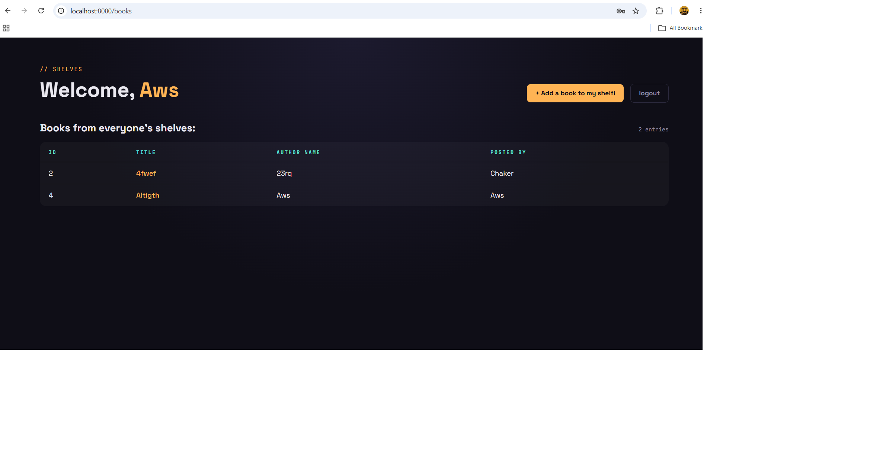

# Book Club 📚

A Spring Boot web application where friends share thoughts on books. It combines **user authentication** (login and registration with BCrypt) with a **one-to-many relationship**: users can post many books, but each book belongs to the one user who posted it.

## Features

- Register and log in with full validation (name, unique email, password of at least 8 characters, matching confirmation) — passwords are hashed with BCrypt before being stored.
- Logged-in users are redirected to the Books page, which displays all books from the database in a table (ID, Title, Author Name, Posted By).
- Each book title is a link to that book's details page, showing who read it, the author, and their thoughts.
- Users can add books to their shelf with validations: title, author, and thoughts must not be blank.
- One-to-many relationship: each book carries a `user_id` foreign key pointing at the user who posted it.
- **Sensei Bonus:** if the logged-in user posted the book, the details page says "You read..." and "Here are your thoughts".
- **Ninja Bonus:** the details page shows an edit link and a delete button only if the book was posted by the logged-in user. The edit page ("Change your Entry") comes pre-populated with the existing values and applies the same validations as create. The delete button removes the book and redirects to the books page.
- Session protection on every book route: visitors who are not logged in are redirected to the login and registration page.

## Technologies Used

- Java 17
- Spring Boot 3 (Spring Web, Spring Data JPA, Spring Boot DevTools, Validation)
- MySQL + MySQL Driver
- jBCrypt (password hashing)
- JSP + JSTL (Spring form tags for data binding)
- Maven

## How to Run the Project

1. Clone the repository:
   ```bash
   git clone https://github.com/<your-username>/book-club.git
   ```
2. Create the MySQL schema used by the app (in MySQL Workbench):
   ```sql
   CREATE SCHEMA bookclub;
   ```
3. Check `src/main/resources/application.properties` and update the MySQL username/password if yours are different.
4. Run the application from your IDE (run `BookclubApplication.java`) or from the terminal:
   ```bash
   ./mvnw spring-boot:run
   ```
5. Open your browser and go to:
   - `http://localhost:8080/` → register or log in
   - `http://localhost:8080/books` → all books (only when logged in)
   - `http://localhost:8080/books/new` → add a book to your shelf
   - `http://localhost:8080/books/1` → book details (edit/delete visible only to the poster)

## Screenshots

> Replace these placeholders with your own screenshots after running the app.

**Login and Registration page**


**Books page (everyone's shelves)**



**Book details with edit/delete (poster's view)**


**Change your Entry page**


## ERD

```
+----------------+           +--------------------+
|     users      |           |       books        |
+----------------+           +--------------------+
| id (PK)        | 1 ----- n | id (PK)            |
| user_name      |           | title              |
| email          |           | author             |
| password       |           | my_thoughts        |
+----------------+           | created_at         |
                             | updated_at         |
                             | user_id (FK)       |
                             +--------------------+
```
