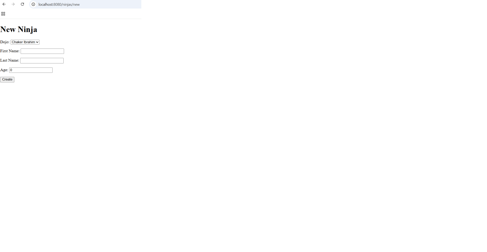
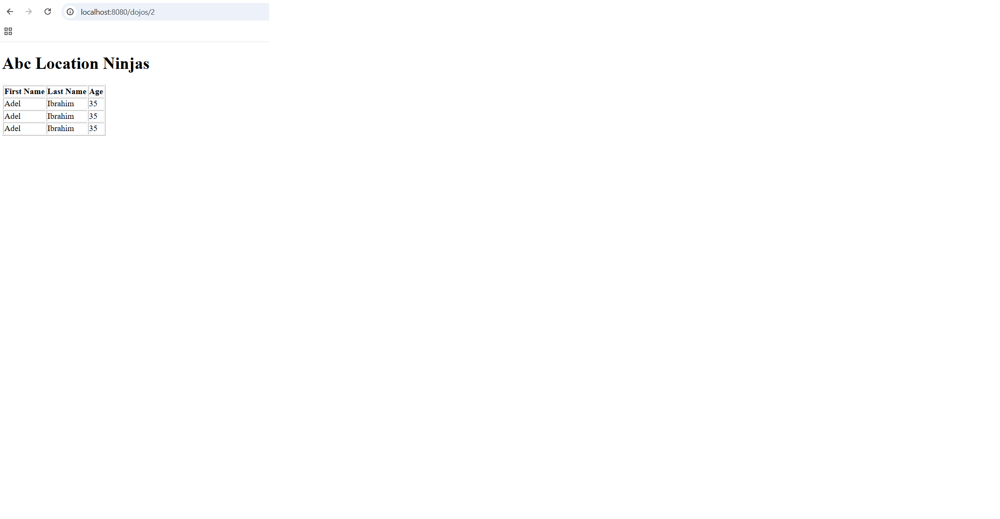

# Dojos and Ninjas 🥷

A Spring Boot web application that keeps track of dojos and all the ninjas that are part of a specific dojo, built to practice **One-to-Many (1:n) relationships** with Spring Data JPA.

## Features

- Create a new dojo through a simple form.
- Create a new ninja and choose their dojo from a dropdown menu (populated with all dojos saved in the database).
- Visit a dojo page that displays all the ninjas that belong to that specific location.
- One-to-Many relationship: one dojo has many ninjas, and each ninja belongs to one dojo through a `dojo_id` foreign key.

## Technologies Used

- Java 11
- Spring Boot (Spring Web, Spring Data JPA, Spring Boot DevTools)
- MySQL + MySQL Driver
- JSP + JSTL (Spring form tags for data binding)
- Maven

## How to Run the Project

1. Clone the repository:
   ```bash
   git clone https://github.com/<your-username>/dojos-and-ninjas.git
   ```
2. Create the MySQL schema used by the app (in MySQL Workbench):
   ```sql
   CREATE SCHEMA relationships;
   ```
3. Check `src/main/resources/application.properties` and update the MySQL username/password if yours are different:
   ```properties
   spring.datasource.url=jdbc:mysql://localhost:3306/relationships
   spring.datasource.username=root
   spring.datasource.password=root
   ```
4. Run the application from your IDE (run `DojosandninjasApplication.java`) or from the terminal:
   ```bash
   ./mvnw spring-boot:run
   ```
5. Open your browser and go to:
   - `http://localhost:8080/dojos/new` → create a dojo
   - `http://localhost:8080/ninjas/new` → create a ninja
   - `http://localhost:8080/dojos/1` → see all ninjas of dojo #1

## Screenshots


**New Dojo page**


**New Ninja page (with dojo dropdown)**



**Dojo page showing its ninjas**



## ERD

```
+----------------+           +--------------------+
|     dojos      |           |       ninjas       |
+----------------+           +--------------------+
| id (PK)        | 1 ----- n | id (PK)            |
| name           |           | first_name         |
| created_at     |           | last_name          |
| updated_at     |           | age                |
+----------------+           | created_at         |
                             | updated_at         |
                             | dojo_id (FK)       |
                             +--------------------+
```
