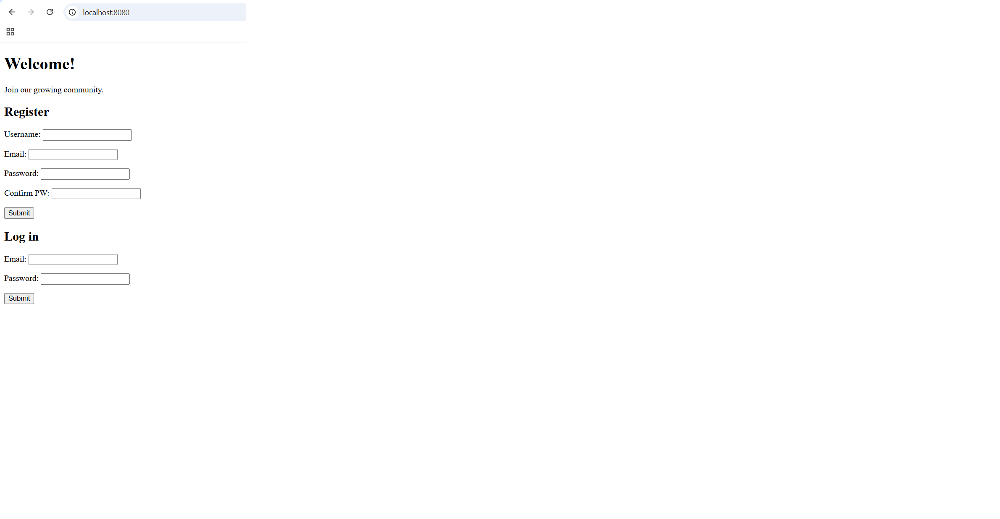
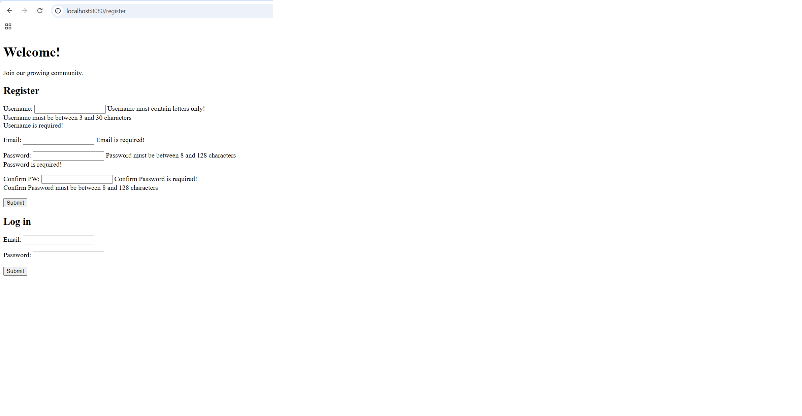

# Login and Registration 🔐

A Spring Boot web application that focuses on **user authentication**: registration with validation, login with BCrypt password checking, and session management.

## Features

- Register a new user with full validation: username (letters only, at least 3 characters), valid unique email, password of at least 8 characters, and matching password confirmation.
- Log in with email and password: the app checks whether the email belongs to a user in the database, then verifies the password against the stored BCrypt hash.
- Passwords are never stored in plain text — they are hashed with **BCrypt** before being saved.
- The password confirmation field is marked `@Transient`, so it is never persisted to the database.
- Session management: the logged-in user's ID is stored in session, and the dashboard greets them by name.
- Protected success page: trying to access `/home` without being logged in redirects back to the login and registration page.
- Logout terminates the session.

## Technologies Used

- Java 17
- Spring Boot 3 (Spring Web, Spring Data JPA, Spring Boot DevTools, Validation)
- MySQL + MySQL Driver
- jBCrypt (password hashing)
- JSP + JSTL (Spring form tags for data binding)
- Maven

## How to Run the Project

1. Clone the repository:
   ```bash
   git clone https://github.com/<your-username>/login-and-registration.git
   ```
2. Create the MySQL schema used by the app (in MySQL Workbench):
   ```sql
   CREATE SCHEMA authentication;
   ```
3. Check `src/main/resources/application.properties` and update the MySQL username/password if yours are different.
4. Run the application from your IDE (run `AuthenticationApplication.java`) or from the terminal:
   ```bash
   ./mvnw spring-boot:run
   ```
5. Open your browser and go to:
   - `http://localhost:8080/` → register or log in
   - `http://localhost:8080/home` → the dashboard (only when logged in)
   - `http://localhost:8080/logout` → log out

## Screenshots


**Login and Registration page**



**Validation errors displayed**



**Dashboard (success page)**


## How Authentication Works

```
 Registration                          Login
 ------------                          -----
 form (User + confirm)                 form (LoginUser)
        |                                    |
        v                                    v
 model validations (@NotEmpty,         model validations
 @Email, @Size, @Pattern)                    |
        |                                    v
        v                              service: find user by email
 service: email taken?                 -> reject if not found
 password == confirm?                  -> BCrypt.checkpw() against hash
        |                                    |
        v                                    v
 BCrypt.hashpw() -> save user          user returned
        |                                    |
        +---------> session.setAttribute("userId", id) <---------+
                              |
                              v
                       redirect:/home
```
