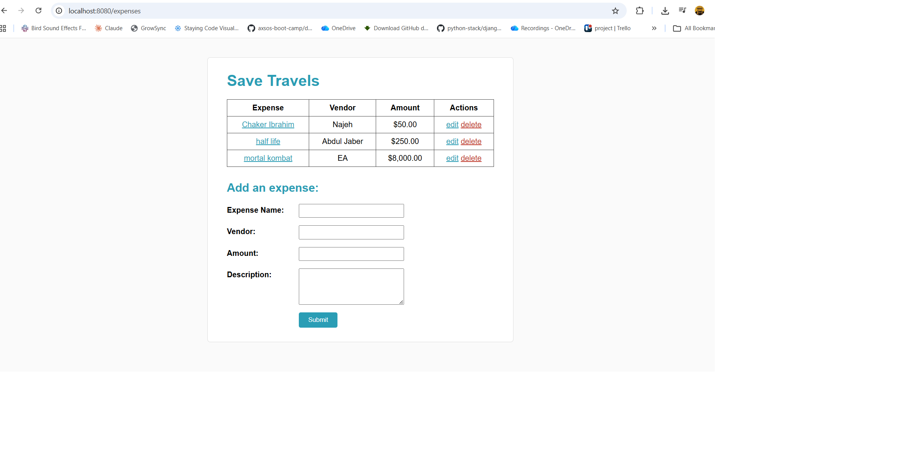
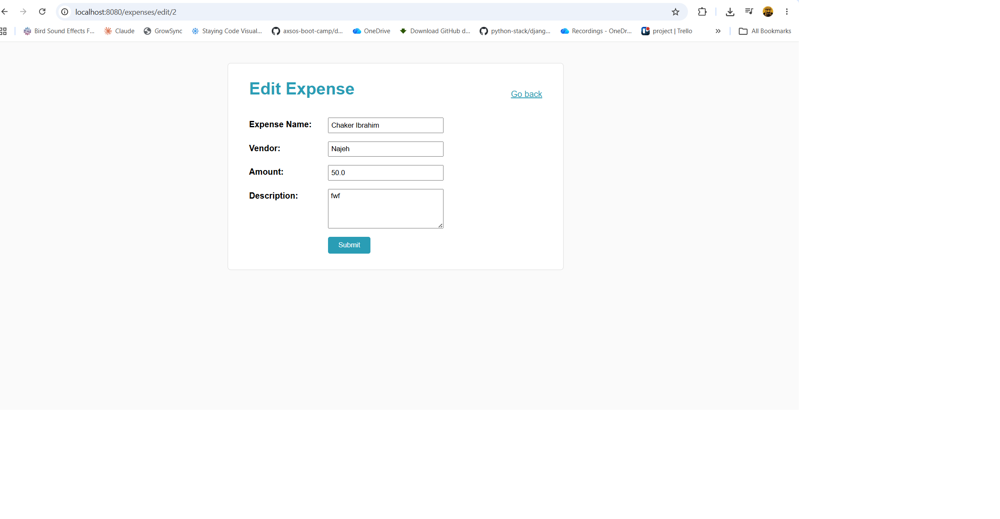
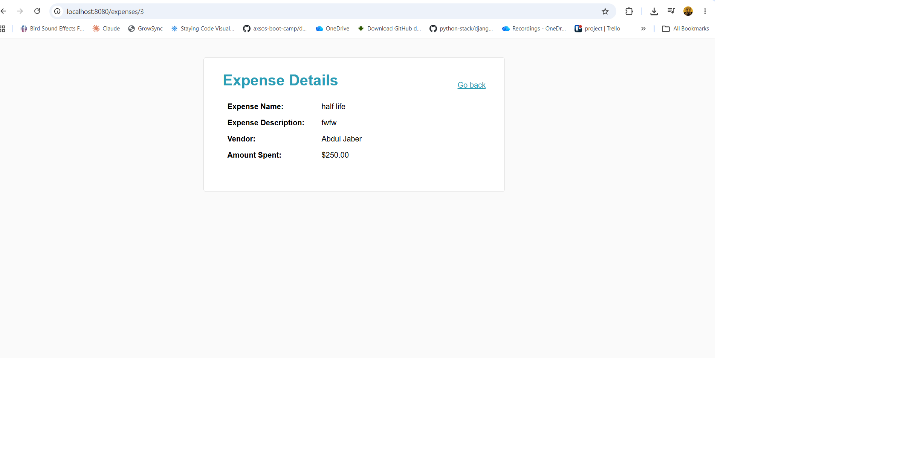
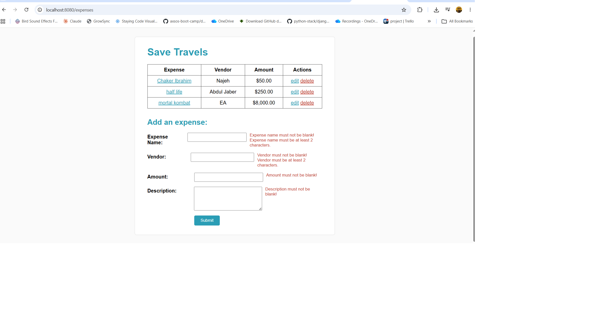

# Save Travels 🌴

A full-stack expense tracker built with **Spring Boot**. Helps a friend budget for their trip to Hawaii by recording, viewing, editing, and deleting expenses — my first complete CRUD project!

## Screenshots

### Main Page — Expenses Table + Add Form


### Edit Expense


### Expense Details


### Validations


## Features

- **View all expenses** in a table (expense name, vendor, amount)
- **Add an expense** through a validated form
- **Edit an expense** with a pre-filled form (RESTful PUT)
- **Delete an expense** with one click (RESTful DELETE)
- **View expense details** by clicking the expense name — the description is shown only on the Show and Edit pages
- **Validations** — no field can be blank, and the amount must be greater than 0. Errors are displayed on the page so the user can fix their input and re-submit.

## Technologies Used

- **Java 11**
- **Spring Boot 2.7** (Spring MVC)
- **Spring Data JPA / Hibernate** — ORM and database access
- **MySQL** — database
- **JSP + JSTL + Spring Form Tags** — views
- **Bean Validation** — server-side form validation
- **Maven** — build tool
- **CSS** — styling

## How to Run the Project

1. **Clone the repository**
   ```bash
   git clone https://github.com/<your-username>/savetravels.git
   cd savetravels
   ```

2. **Make sure MySQL is running** on `localhost:3306`

3. **Set your MySQL credentials** in `src/main/resources/application.properties`:
   ```properties
   spring.datasource.username=root
   spring.datasource.password=YOUR_PASSWORD
   ```
   > The `save_travels` database and `expenses` table are created automatically on first run.

4. **Run the application**
   ```bash
   mvn spring-boot:run
   ```
   Or run `SavetravelsApplication.java` from your IDE.

5. **Open your browser** at:
   ```
   http://localhost:8080/expenses
   ```
