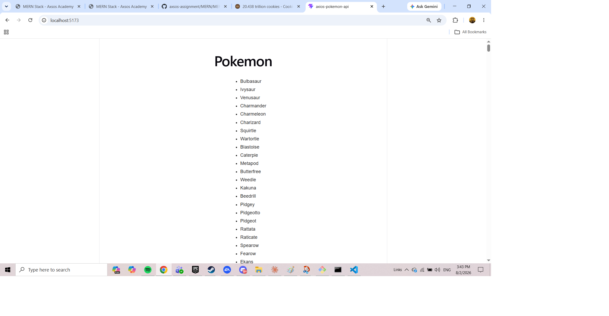
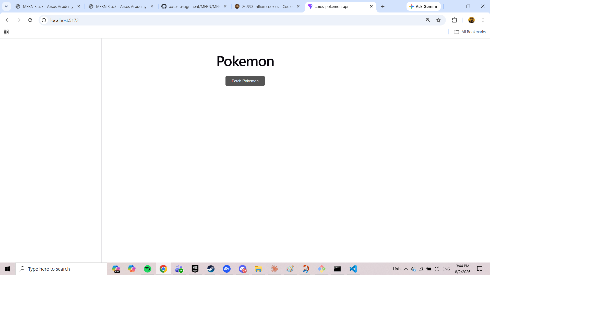
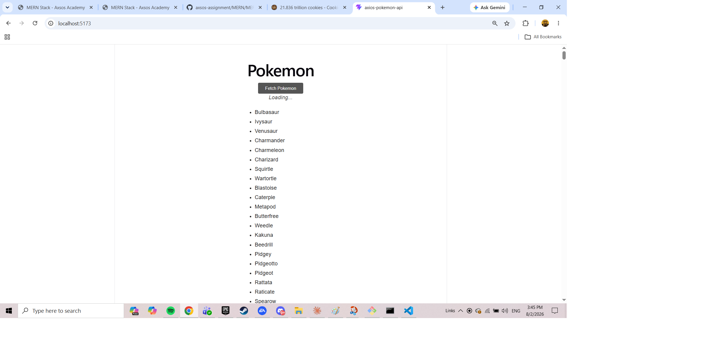

# Axios Pokemon API

Click a button, fetch all 807 Pokemon from the PokeAPI, and list their names. A rewrite of the earlier `fetch` version using Axios.

Built for the Axsos Academy MERN Stack course (APIs → Axios Pokemon API).



---

## Features

- **One-click fetch** — pulls all 807 Pokemon in a single request
- **Loading message** while the request is in flight, so a click never looks like nothing happened
- **Error handling** — a readable message if the request fails, instead of a blank page
- **Non-blocking** — the page stays responsive while waiting for the response





---

## Technologies Used

- **React 18** — functional components and JSX
- **Axios** — makes the GET request and parses the response
- **useState hook** — holds the Pokemon list and the request status
- **Vite** — build tool and development server
- **CSS** — plain stylesheet imported directly into the component

---

## How to Run

You'll need [Node.js](https://nodejs.org) installed.

**1. Clone the repository**

```bash
git clone https://github.com/your-username/axios-pokemon-api.git
cd axios-pokemon-api
```

**2. Install the dependencies**

```bash
npm install
```

This installs Axios along with everything else listed in `package.json`.

**3. Start the development server**

```bash
npm run dev
```

**4. Open the app**

Vite will print a local link in the terminal, usually `http://localhost:5173`. Ctrl/Cmd + click it, or paste it into your browser.

To stop the server, press `Ctrl + C` in the terminal.

---

## Project Structure

```
axios-pokemon-api/
├── src/
│   ├── components/
│   │   └── PokemonList.jsx   the button, the request, and the list
│   ├── App.jsx
│   ├── App.css
│   └── main.jsx
├── index.html
└── package.json
```

---

## How It Works

Clicking the button fires a GET request through Axios. It returns a Promise, so the browser doesn't wait — `.then` runs later, once the response arrives:

```jsx
axios.get("https://pokeapi.co/api/v2/pokemon?limit=807")
    .then( response => {
        setPokemon( response.data.results );
        setLoading(false);
    })
    .catch( err => {
        setError("Could not load Pokemon. Please try again.");
        setLoading(false);
    });
```

Two things Axios does that `fetch` doesn't:

- **`.get` names the request type directly**, instead of passing a config object
- **The response is already parsed**, so the data is on `response.data` right away — no second `.then` calling `.json()`

The `?limit=807` is a query parameter asking the API for every Pokemon rather than the default 20. The names live inside `response.data.results`, since the API wraps its list in an object alongside `count`, `next`, and `previous`.

Once the names are in state, `map` renders them:

```jsx
<ul className="pokemon-list">
    { pokemon.map( (poke, i) =>
        <li key={ i }>{ poke.name }</li>
    ) }
</ul>
```

The array starts empty, so nothing shows until the request comes back — and a ternary displays a loading message in the meantime.