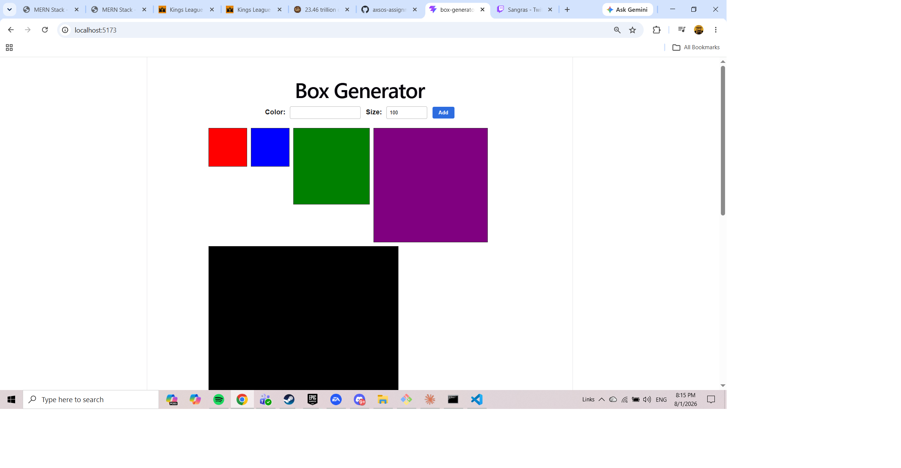
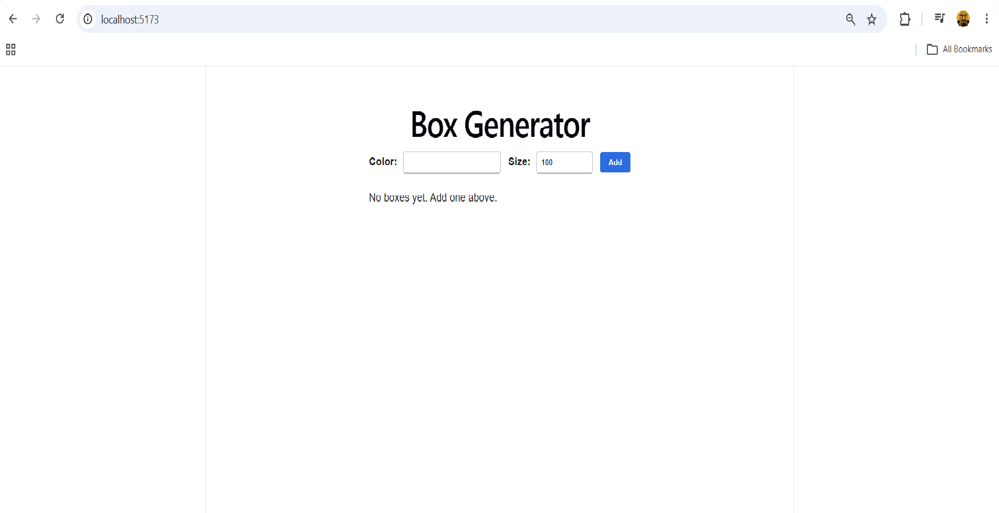

# Box Generator

Type a colour, pick a size, hit Add — a new box appears next to the ones already there. Boxes fill the row and wrap onto the next line as you keep going.

Built for the Axsos Academy MERN Stack course (Lifting State → Box Generator).



---

## Features

- **Add boxes in any colour** — type a colour name or a hex code
- **Set the size** — a second input controls the box's width and height in pixels
- **Boxes appear instantly** and line up horizontally, wrapping when the row is full
- **Inputs clear after each box is added**, ready for the next one
- **Empty colours are rejected** with a message instead of an invisible box
- **Helpful empty state** before the first box is added




---

## Technologies Used

- **React 18** — functional components and JSX
- **useState hook** — holds the list of boxes and the form's inputs
- **Vite** — build tool and development server
- **CSS** — flexbox for the layout, inline styles for each box's colour and size

---

## How to Run

You'll need [Node.js](https://nodejs.org) installed.

**1. Clone the repository**

```bash
git clone https://github.com/your-username/box-generator.git
cd box-generator
```

**2. Install the dependencies**

```bash
npm install
```

**3. Start the development server**

```bash
npm run dev
```

**4. Open the app**

Vite will print a local link in the terminal, usually `http://localhost:5173`. Ctrl/Cmd + click it, or paste it into your browser.

To stop the server, press `Ctrl + C` in the terminal.

---

## Project Structure

```
box-generator/
├── src/
│   ├── components/
│   │   ├── BoxForm.jsx      the colour and size inputs
│   │   └── BoxDisplay.jsx   renders every box
│   ├── App.jsx              holds the list of boxes
│   ├── App.css              styles
│   └── main.jsx             renders App into index.html
├── index.html
└── package.json
```

---

## How It Works

The form and the display are siblings, so they can't pass data to each other directly — props only flow downward. The list of boxes therefore lives in **App**, their shared parent, and App hands a function down to the form:

```jsx
const [boxes, setBoxes] = useState([]);

const addBox = (newBox) => {
    setBoxes([ ...boxes, newBox ]);
};

<BoxForm onNewBox={ addBox } />
<BoxDisplay boxes={ boxes } />
```

When the form submits, it calls that function and passes the new box upward:

```jsx
props.onNewBox({ color, size });
```

The spread operator builds a **new** array rather than pushing into the old one, so React sees a fresh value and re-renders. BoxDisplay then turns each object into a div with `map`, using inline styles for the parts that change per box:

```jsx
{ props.boxes.map( (box, i) =>
    <div
        key={ i }
        className="box"
        style={{
            backgroundColor: box.color,
            width: box.size + "px",
            height: box.size + "px"
        }}
    ></div>
) }
```