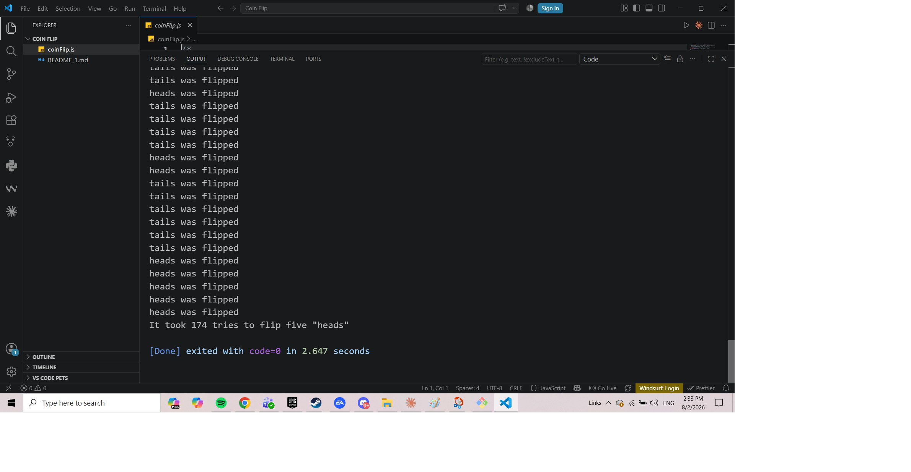
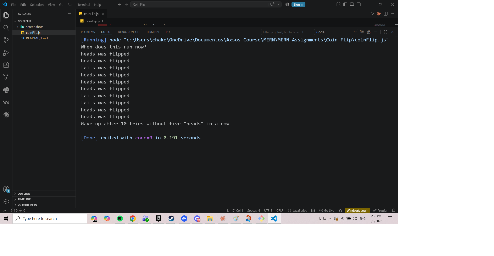

# Coin Flipping

Flips a coin until it lands on heads five times in a row — without freezing everything else while it works. A rewrite of a blocking `while` loop using Promises.

Built for the Axsos Academy MERN Stack course (APIs → Coin Flipping).



---

## Features

- **Flips until five heads in a row**, logging each toss as it happens
- **Non-blocking** — code written after the call runs immediately instead of waiting
- **Resolves with the attempt count** once the streak is reached
- **Rejects after too many tries**, so an unlucky run can't go on forever
- **Handled with `.then` and `.catch`**, keeping success and failure clearly separated



---

## Technologies Used

- **JavaScript (ES6)** — arrow functions, template literals, `const` and `let`
- **Promises** — `new Promise`, `resolve`, `reject`, `.then`, `.catch`
- **setTimeout** — schedules each flip so the thread is never held

---

## How to Run

You'll need [Node.js](https://nodejs.org) installed. There are no dependencies to install.

**1. Clone the repository**

```bash
git clone https://github.com/your-username/coin-flipping.git
cd coin-flipping
```

**2. Run the file**

```bash
node coinFlip.js
```

The flips print as they happen, followed by the result.

To watch the rejection path instead, lower `MAX_ATTEMPTS` to about `10` and run it a few times.

---

## Project Structure

```
coin-flipping/
├── coinFlip.js    the coin toss and the Promise
└── README.md
```

---

## How It Works

The original version used a `while` loop, which held the single JavaScript thread until it finished — everything after it had to wait.

This version returns a Promise immediately and reports the outcome later. Each flip is scheduled with `setTimeout` rather than run in a loop, so the thread is handed back between tosses:

```js
const flip = () => {
    attempts++;
    const result = tossCoin();

    if (result === "heads") {
        headsCount++;
    } else {
        headsCount = 0;
    }

    if (headsCount === 5) {
        resolve(`It took ${attempts} tries to flip five "heads"`);
    } else if (attempts >= MAX_ATTEMPTS) {
        reject(`Gave up after ${attempts} tries without five "heads" in a row`);
    } else {
        setTimeout(flip, 0);
    }
};
```

Whichever of `resolve` or `reject` gets called decides where the result goes:

```js
fiveHeads()
    .then( res => console.log(res) )
    .catch( err => console.log(err) );

console.log("When does this run now?");
```

That last line prints **before any flip appears**, which is the proof it worked. The Promise is created and returned instantly; the flipping happens afterwards, and `.then` fires only once the streak is complete.

Wrapping code in a Promise doesn't make it asynchronous on its own — a `while` loop inside the executor would still block. `setTimeout` is what breaks the work into pieces and lets the rest of the program breathe.
