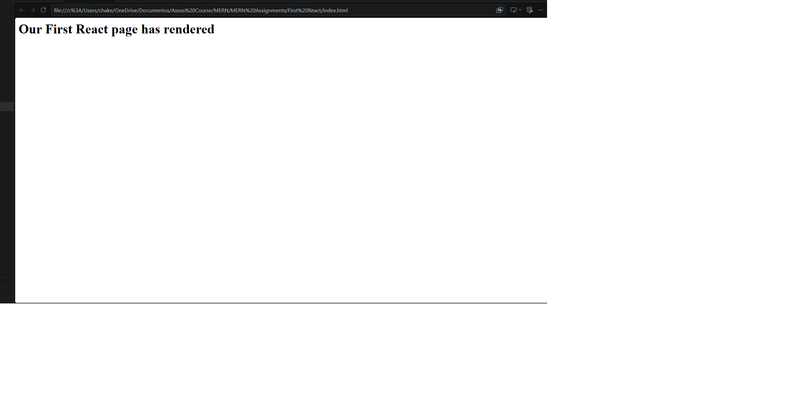

# Hello React

My first React application — a single HTML page that renders a React element into the DOM, with **no build tools, no npm and no JSX**. React is loaded straight from a CDN and the element is created by hand with `React.createElement`.

Built as part of the **MERN Stack** course at [Axsos Academy](https://learn.axsos.academy/) — *Intro to React* module.

---

## Screenshots


### After React renders


---

## Features

- A single `index.html` file — the whole app lives in one place
- React and ReactDOM loaded from a **CDN**, so there is nothing to install
- A React element built with **`React.createElement`** instead of JSX
- **`ReactDOM.render`** mounts the element into the `<div id="root">` container
- The placeholder text inside `#root` is **replaced** by React once the scripts run, which shows exactly when React takes over the DOM

---

## Technologies Used

| Technology | Purpose |
|---|---|
| **React 16** | Creating the element |
| **ReactDOM 16** | Rendering the element into the page |
| **unpkg CDN** | Delivering the React libraries without npm |
| **HTML5** | Page structure and the root container |
| **JavaScript (ES6)** | `const` and the script logic |

---

## Project Structure

```
hello-react/
├── index.html      # The entire application
└── README.md
```

---

## How to Run the Project

### Prerequisites

Just a web browser. There is nothing to install and no server required.

### Steps

1. **Clone the repository**

   ```bash
   git clone https://github.com/YOUR-USERNAME/YOUR-REPO.git
   ```

2. **Navigate into the project folder**

   ```bash
   cd hello-react
   ```

3. **Open the file in your browser**

   Double-click `index.html`, or from the terminal:

   ```bash
   start index.html     # Windows
   ```

> **Tip:** If you use VS Code, the **Live Server** extension is a nicer way to run it — right-click `index.html` and choose *Open with Live Server*. The page then reloads automatically every time you save.

---

## How It Works

The page starts with an empty container and some placeholder text:

```html
<div id="root">
    <h1>First React page rendering...</h1>
</div>
```

The two CDN script tags load the React libraries and expose the global `React` and `ReactDOM` objects. Then the app script runs:

```js
const App = React.createElement("h1", {}, "Our First React page has rendered");
ReactDOM.render(App, document.getElementById("root"));
```

`React.createElement` takes three arguments:

| Argument | Value here | Meaning |
|---|---|---|
| 1st | `"h1"` | The type of element to create |
| 2nd | `{}` | The props (empty for now) |
| 3rd | `"Our First React page..."` | The content inside the element |

`ReactDOM.render` then takes that element and injects it into `#root`, **wiping out whatever was already inside**. That is why you see the placeholder flash for a split second before React replaces it.

---

## What I Learned

- What the **`root` div** actually is: the single spot on the page that React controls
- That **JSX is optional** — it is just nicer syntax that compiles down to `React.createElement` calls
- Why the script tags go at the **bottom of the body**: `document.getElementById("root")` would return `null` if the script ran before the div existed
- The difference between **React** (creates elements) and **ReactDOM** (puts them on the page) — two separate libraries with two separate jobs
- That `ReactDOM.render` is the **React 16** API; newer projects use `ReactDOM.createRoot` instead

---

## Author

**Chaker** — MERN Stack student at Axsos Academy
