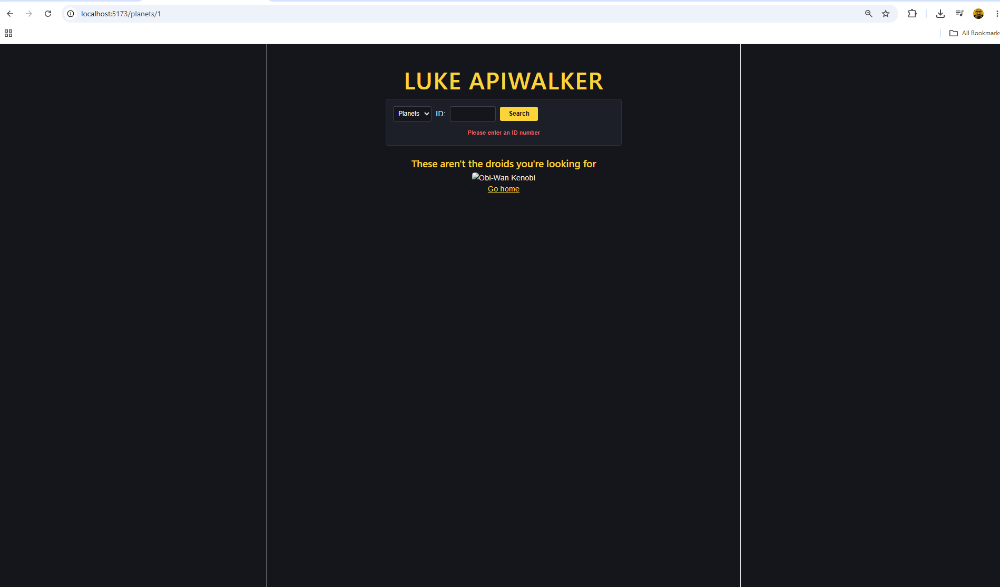
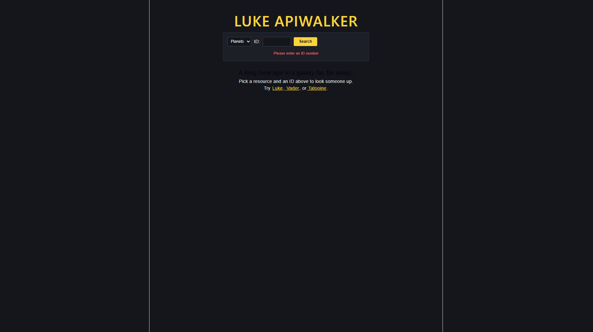

# Luke APIwalker

Search the Star Wars API by resource and ID. Pick people or planets, enter a number, and get the details — with a link from any character to their homeworld.

Built for the Axsos Academy MERN Stack course (React Routing → Luke APIwalker).



---

## Features

- **Persistent search bar** — stays on screen on every route
- **Two resources** — a dropdown switches between people and planets
- **Search by ID** — enter a number and go straight to that record
- **Five attributes per resource**, tailored to whether it's a character or a planet
- **Homeworld lookup** — characters show their homeworld's name, linked to that planet's own page
- **Bookmarkable URLs** — `/people/1` works on a fresh page load, no search needed
- **A friendly failure** — bad IDs get Obi-Wan and "These aren't the droids you're looking for"




---

## Technologies Used

- **React 18** — functional components and JSX
- **React Router** — client-side routing, URL params, and programmatic navigation
- **Axios** — makes the API requests
- **useState / useEffect** — holds the data and triggers the fetch when the URL changes
- **Vite** — build tool and development server
- **CSS** — flexbox for the search bar, a dark theme for the galaxy

---

## How to Run

You'll need [Node.js](https://nodejs.org) installed.

**1. Clone the repository**

```bash
git clone https://github.com/your-username/luke-apiwalker.git
cd luke-apiwalker
```

**2. Install the dependencies**

```bash
npm install
```

This installs React Router and Axios along with everything else in `package.json`.

**3. Start the development server**

```bash
npm run dev
```

**4. Open the app**

Vite will print a local link in the terminal, usually `http://localhost:5173`. Ctrl/Cmd + click it, or paste it into your browser.

To stop the server, press `Ctrl + C` in the terminal.

---

## Project Structure

```
luke-apiwalker/
├── public/
│   └── obiwan.jpg            shown when a request fails
├── src/
│   ├── components/
│   │   ├── SearchForm.jsx    the persistent search bar
│   │   ├── Home.jsx          the landing page
│   │   └── Detail.jsx        fetches and displays one resource
│   ├── App.jsx               defines the routes
│   ├── App.css
│   └── main.jsx              wraps the app in BrowserRouter
├── index.html
└── package.json
```

---

## Routes

| Path | Component | Example |
|---|---|---|
| `/` | Home | the landing page |
| `/:resource/:id` | Detail | `/people/1`, `/planets/3` |

One dynamic route covers both resources, because the resource name is captured from the URL alongside the ID.

---

## How It Works

`BrowserRouter` wraps the app in `main.jsx` so every component can see the URL. The search form sits **outside** `Routes`, which is what keeps it on screen no matter where you navigate:

```jsx
<SearchForm />

<Routes>
    <Route path="/" element={ <Home /> } />
    <Route path="/:resource/:id" element={ <Detail /> } />
</Routes>
```

Submitting the form doesn't fetch anything — it just changes the URL:

```jsx
navigate(`/${resource}/${id}`);
```

`Detail` then reads those values back out of the URL and fetches:

```jsx
const { resource, id } = useParams();

useEffect(() => {
    axios.get(`https://swapi.dev/api/${resource}/${id}/`)
        .then( response => setData(response.data) )
        .catch( err => setError(true) );
}, [resource, id]);
```

The dependency array is what makes repeat searches work. `Detail` stays mounted between searches, so only `id` changes — and listing it as a dependency is what tells `useEffect` to run again instead of leaving the old character on screen.

Because everything lives in the URL, `/people/4` can be bookmarked, shared, or opened cold, and it loads Vader without touching the form.

A character's homeworld arrives as a URL rather than a name, so it takes a second request — and its ID gets pulled off the end of that URL to build the link:

```jsx
const getIdFromUrl = (url) => {
    const parts = url.split("/").filter( part => part !== "" );
    return parts[ parts.length - 1 ];
};
```