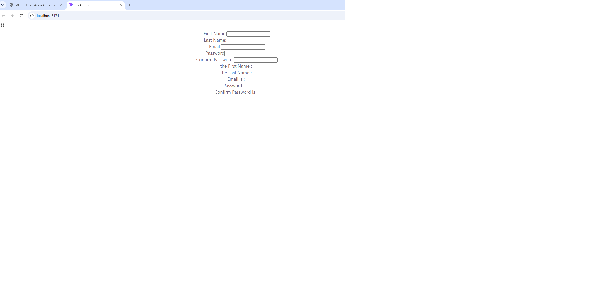

# Hook Form

A React form built with the `useState` hook that displays the entered data **live**, in real time, right below the form as the user types.

Built as part of the **MERN Stack** course at [Axsos Academy](https://learn.axsos.academy/) — *Lifting State* module.

---

## Screenshots


### Form with live data



---

## Features

- Five controlled inputs: **First Name**, **Last Name**, **Email**, **Password** and **Confirm Password**
- **Live preview** — the "Your Form Data" section updates on every keystroke, no submit button needed
- Each input is a *controlled component*, so React state is the single source of truth

---

## Technologies Used

| Technology | Purpose |
|---|---|
| **React** | Building the UI with components |
| **useState Hook** | Managing the form state |
| **Vite** | Development server and build tool |
| **JavaScript (ES6+)** | Arrow functions, destructuring, template literals |
| **HTML5 / CSS** | Markup and basic styling |

---

## Project Structure

```
hook-form/
├── src/
│   ├── components/
│   │   └── Form.jsx      # The form component and all its state
│   ├── App.jsx           # Renders the Form component
│   └── main.jsx          # React entry point
├── index.html
├── package.json
└── README.md
```

---

## How to Run the Project

### Prerequisites

- [Node.js](https://nodejs.org/) (v18 or higher)
- npm (comes with Node.js)

### Steps

1. **Clone the repository**

   ```bash
   git clone https://github.com/YOUR-USERNAME/YOUR-REPO.git
   ```

2. **Navigate into the project folder**

   ```bash
   cd hook-form
   ```

3. **Install the dependencies**

   ```bash
   npm install
   ```

4. **Start the development server**

   ```bash
   npm run dev
   ```

5. **Open the app in your browser**

   ```
   http://localhost:5173
   ```

---

## How It Works

Each input is tied to a piece of state:

```jsx
const [firstName, setFirstName] = useState("");
```

The `value` attribute reads **from** state and `onChange` writes **back to** state:

```jsx
<input
  type="text"
  value={firstName}
  onChange={(e) => setFirstName(e.target.value)}
/>
```

Every keystroke fires `onChange`, which updates the state and triggers a re-render. Because the preview section below the form reads the same state variables, it stays perfectly in sync — that is what makes the live update work.

---

## What I Learned

- The difference between **controlled** and uncontrolled inputs in React
- Why calling a state setter directly in the component body causes an **infinite render loop**
- How `&&` short-circuit evaluation is used for **conditional rendering** in JSX
- Why each input needs **its own state variable** (sharing one between Password and Confirm Password makes the match check impossible)

---

## Author

**Chaker and Aws** — MERN Stack student at Axsos Academy
