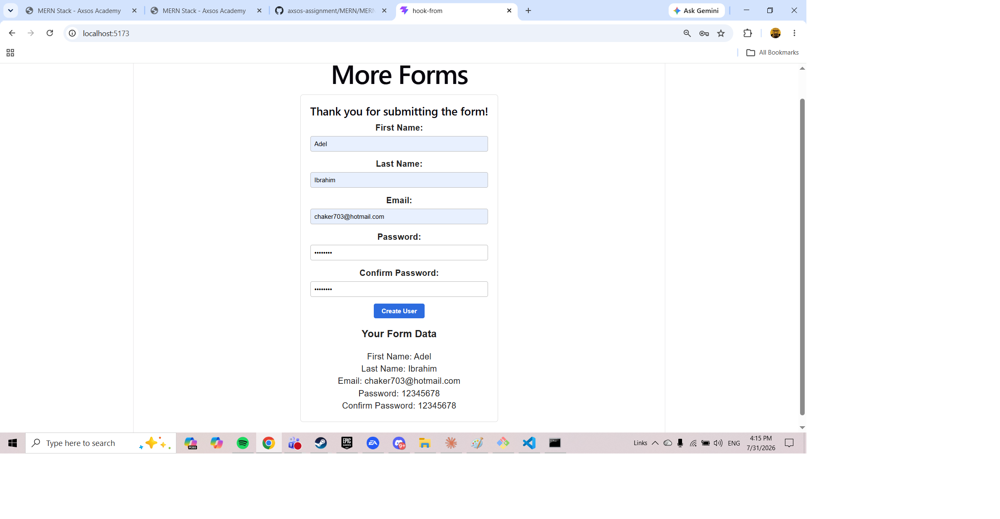
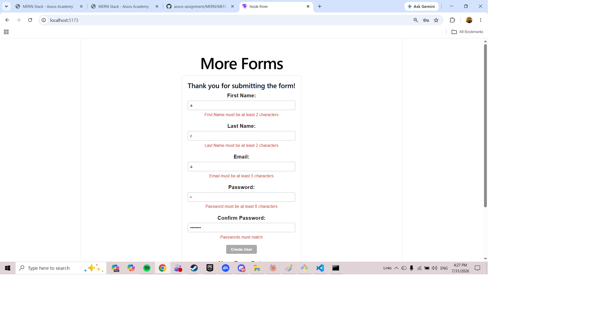
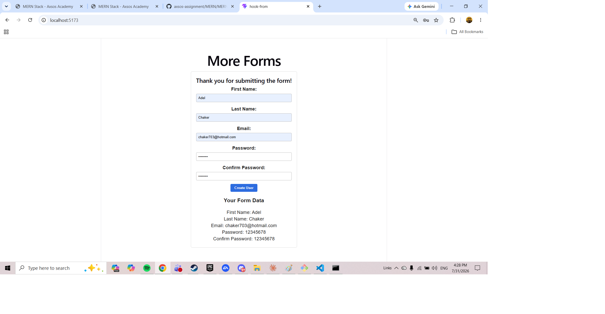

# More Forms

A React form that validates what you type as you type it. Error messages appear the moment a field breaks a rule and disappear the moment it's fixed — no page reload, no submit button needed to find out.

Built for the Axsos Academy MERN Stack course (Lifting State → More Forms).



---

## Features

- **Five form fields** — First Name, Last Name, Email, Password, Confirm Password
- **Live data display** — everything typed shows up underneath the form in real time
- **Real-time validation** — errors appear and disappear on every keystroke
  - First Name and Last Name must be at least 2 characters
  - Email must be at least 5 characters
  - Password must be at least 8 characters
  - Confirm Password must match the password
- **No errors on blank fields** — nothing is flagged before you've typed anything
- **Disabled submit button** — stays locked until every field is valid
- **Form resets after submit** and confirms with a thank-you message





---

## Technologies Used

- **React 18** — functional components and JSX
- **useState hook** — manages every input value and every error message
- **Vite** — build tool and development server
- **CSS** — plain stylesheet imported directly into the component

---

## How to Run

You'll need [Node.js](https://nodejs.org) installed.

**1. Clone the repository**

```bash
git clone https://github.com/your-username/more-forms.git
cd more-forms
```

**2. Install the dependencies**

```bash
npm install
```

**3. Start the development server**

```bash
npm run dev
```

**4. Open the app**

Vite will print a local link in the terminal, usually `http://localhost:5173`. Ctrl/Cmd + click it, or paste it into your browser.

To stop the server, press `Ctrl + C` in the terminal.

---

## Project Structure

```
more-forms/
├── src/
│   ├── components/
│   │   └── UserForm.jsx    all form logic, state, and validation
│   ├── App.jsx             parent component
│   ├── App.css             styles
│   └── main.jsx            renders App into index.html
├── index.html
└── package.json
```

---

## How It Works

Each input is a **controlled component** — its `value` comes from state, and its `onChange` writes back to that state. React is the single source of truth for what's in the box.

Each input also has a **second** piece of state holding its error message. The `onChange` handler updates the value and re-checks the rule in one go:

```jsx
const handleFirstName = (e) => {
    setFirstName(e.target.value);

    if (e.target.value.length === 0) {
        setFirstNameError("");
    } else if (e.target.value.length < 2) {
        setFirstNameError("First Name must be at least 2 characters");
    } else {
        setFirstNameError("");
    }
};
```

The message is then rendered with a ternary. An empty string is falsy in JavaScript, so `""` means "show nothing" — which is what handles blank fields:

```jsx
{ firstNameError ? <p className="error">{ firstNameError }</p> : "" }
```