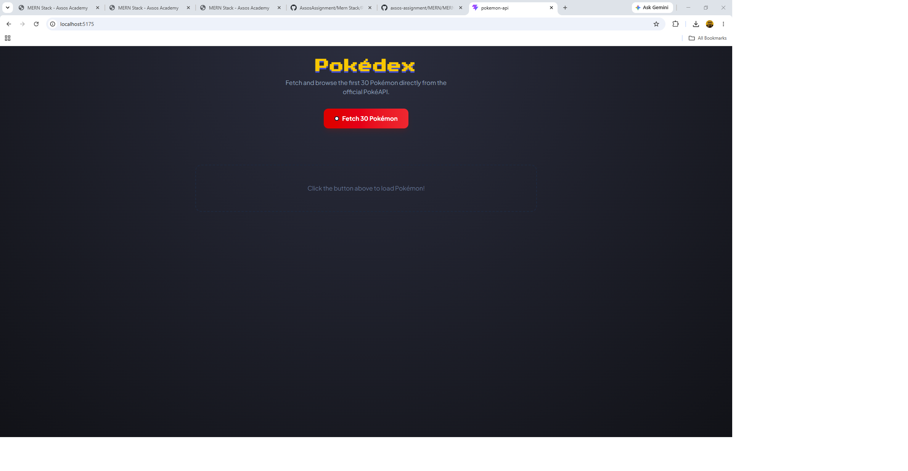
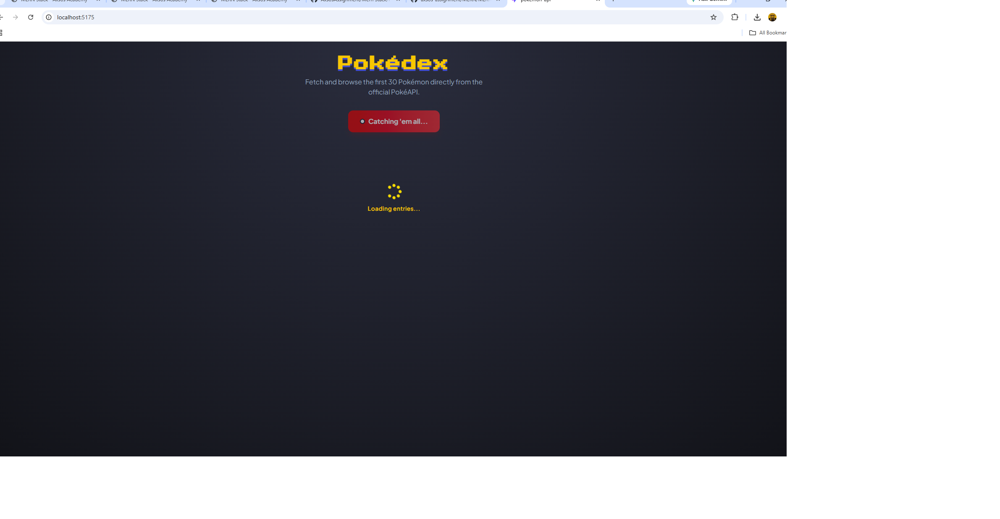
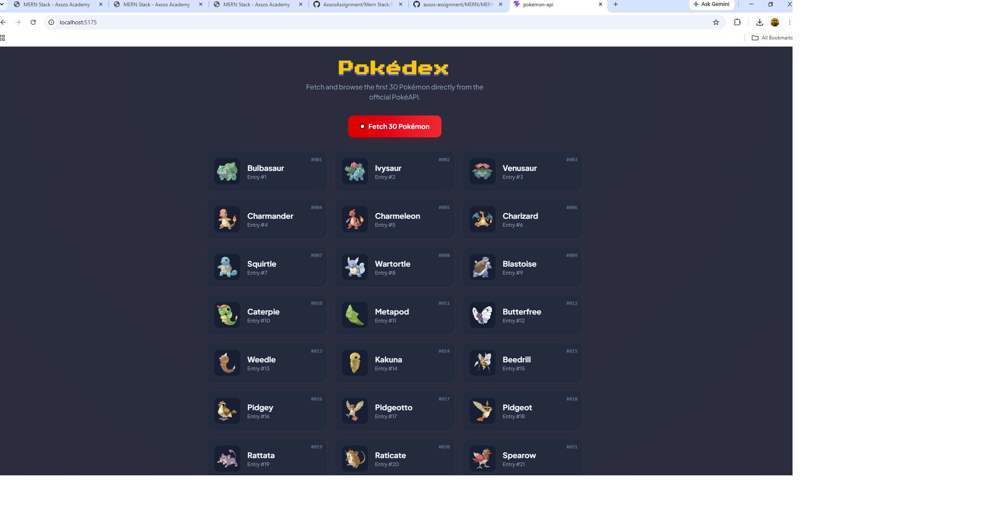

# Pokédex

A React app that fetches Pokémon from the public **PokéAPI** and displays them as a grid of cards. Nothing loads until the user clicks the button — the request is triggered on demand, with loading and error states handled along the way.

Built as part of the **MERN Stack** course at [Axsos Academy](https://learn.axsos.academy/) — *APIs* module.

---

## Screenshots

### Before fetching


### While loading


### Pokémon loaded


---

## Features

- **Fetch on click** — the API request is triggered by a button, not on page load
- **Loading state** — a spinner and "Catching 'em all..." message while the request is in flight
- **Error handling** — a `try / catch` block catches failed requests and displays the error message
- **Empty state** — a placeholder prompt before anything has been fetched
- **Dynamic sprites** — each card builds its official artwork image URL from the Pokémon's index
- **Responsive grid** — 1 column on mobile, 2 on tablet, 3 on desktop
- Button is **disabled while loading** to prevent duplicate requests

---

## Technologies Used

| Technology | Purpose |
|---|---|
| **React** | Building the UI |
| **useState Hook** | Storing the Pokémon list, loading flag and error message |
| **Fetch API** | Making the HTTP request to PokéAPI |
| **async / await** | Handling the asynchronous request cleanly |
| **PokéAPI** | The public REST API supplying the Pokémon data |
| **Tailwind CSS** | Styling and responsive layout |
| **Font Awesome** | The loading spinner icon |
| **Vite** | Development server and build tool |

---

## Project Structure

```
pokedex/
├── src/
│   ├── components/
│   │   └── Pokemon.jsx     # Fetch logic, states and the card grid
│   ├── App.jsx             # Renders the Pokemon component
│   └── main.jsx            # React entry point
├── index.html
├── package.json
└── README.md
```

---

## API Reference

**Endpoint used:**

```
https://pokeapi.co/api/v2/pokemon?limit=18
```

**Response shape:**

```json
{
  "count": 1302,
  "results": [
    { "name": "bulbasaur", "url": "https://pokeapi.co/api/v2/pokemon/1/" },
    { "name": "ivysaur",   "url": "https://pokeapi.co/api/v2/pokemon/2/" }
  ]
}
```

The list endpoint returns only names and URLs — no images. The sprite for each card is built separately from the Pokémon's position in the list:

```js
`https://raw.githubusercontent.com/PokeAPI/sprites/master/sprites/pokemon/other/official-artwork/${pokemonId}.png`
```

PokéAPI requires **no API key**, so nothing needs to be configured to run this project.

---

## How to Run the Project

### Prerequisites

- [Node.js](https://nodejs.org/) (v18 or higher)
- npm (comes with Node.js)
- An internet connection (the data comes from a live API)

### Steps

1. **Clone the repository**

   ```bash
   git clone https://github.com/YOUR-USERNAME/YOUR-REPO.git
   ```

2. **Navigate into the project folder**

   ```bash
   cd pokedex
   ```

3. **Install the dependencies**

   ```bash
   npm install
   ```

4. **Start the development server**

   ```bash
   npm run dev
   ```

5. **Open the app in your browser**

   ```
   http://localhost:5173
   ```

6. Click **Fetch Pokémon** to load the data.

---

## How It Works

Three pieces of state track the whole request:

```jsx
const [pokemons, setPokemon] = useState([]);   // the data
const [loading, setLoading] = useState(false); // is a request in flight?
const [error, setError] = useState(null);      // did it fail?
```

The fetch function is `async`, so `await` can be used to pause until each step finishes:

```jsx
const fetchPokemon = async () => {
    setLoading(true);
    try {
        const response = await fetch("https://pokeapi.co/api/v2/pokemon?limit=18");
        const data = await response.json();
        setPokemon(data.results);
    } catch (err) {
        setError(err.message);
    } finally {
        setLoading(false);
    }
};
```

Two `await`s are needed because there are two separate waits: first for the server to respond, then for the response body to be parsed into a JavaScript object.

The UI then picks what to show based on which state is currently active:

| Condition | What renders |
|---|---|
| `loading` is true | Spinner |
| `error` is set | Error message |
| `pokemons.length > 0` | The card grid |
| none of the above | "Click the button" placeholder |

Finally, `.map()` turns the array of Pokémon into an array of JSX cards, each with a unique `key`:

```jsx
{pokemons.map((poke, index) => ( ... ))}
```

---

## What I Learned

- How to call a REST API from React using **`fetch`** with **async / await**
- Why two `await`s are needed: one for the response, one for `.json()`
- Using **`try / catch / finally`** so the loading state is always cleared, whether the request succeeds or fails
- Tracking **loading and error states** separately from the data itself
- Rendering a list with **`.map()`** and why React needs a unique **`key`** on each item
- Building image URLs dynamically with **template literals**
- That the list endpoint doesn't include images, so sprites have to be sourced separately

---

## Author

**Chaker** — MERN Stack student at Axsos Academy
