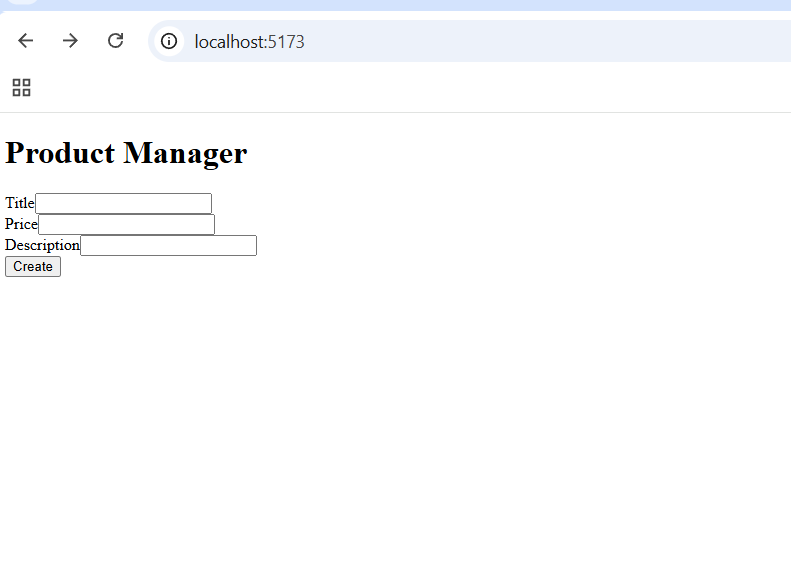
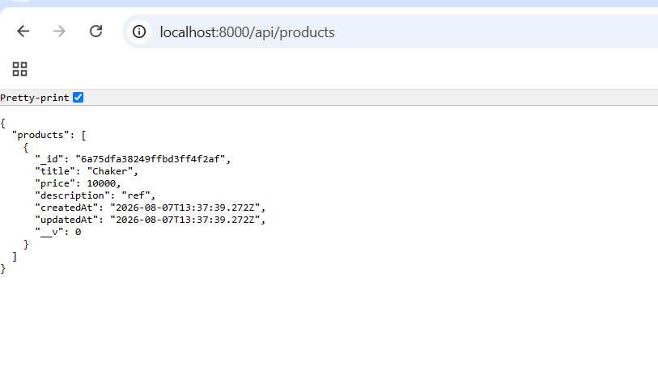

# Product Manager

A full-stack MERN application for managing products. This first version lets users create a product with a title, price, and description through a form on the main page, and saves it to MongoDB.

## Features

- Create a new product from a form on the main page
- Server-side validation with Mongoose (required fields, minimum lengths, non-negative price)
- Products persisted to MongoDB Atlas with automatic `createdAt` / `updatedAt` timestamps
- REST API endpoint to retrieve all saved products

## Technologies Used

**Frontend**
- React 19 (Vite)
- React Router DOM
- Axios

**Backend**
- Node.js
- Express
- Mongoose
- MongoDB Atlas
- CORS, dotenv

## Project Structure

```
product-manager/
├── client/                       # React frontend
│   └── src/
│       ├── pages/
│       │   └── ProductForm.jsx
│       ├── App.jsx
│       └── main.jsx
└── server/                       # Express backend
    ├── config/
    │   └── mongoose.config.js
    ├── controllers/
    │   └── product.controller.js
    ├── models/
    │   └── product.model.js
    ├── routes/
    │   └── product.routes.js
    ├── .env
    └── server.js
```

## API Endpoints

| Method | Endpoint | Description |
|--------|----------|-------------|
| POST | `/api/products` | Create a new product |
| GET | `/api/products` | Retrieve all products |

## Getting Started

### Prerequisites

- Node.js installed
- A MongoDB Atlas account and cluster

### 1. Clone the repository

```bash
git clone <your-repo-url>
cd product-manager
```

### 2. Set up the server

```bash
cd server
npm install
```

Create a `.env` file inside the `server` folder:

```
PORT=8000
MONGO_URI=your_mongodb_connection_string
```

Start the server:

```bash
npm start
```

The server runs on `http://localhost:8000`. You should see `connected to db` in the terminal.

### 3. Set up the client

In a second terminal:

```bash
cd client
npm install
npm run dev
```

The app runs on `http://localhost:5173`.

## Screenshots

### Product Form




### API Response



## Data Model

| Field | Type | Validation |
|-------|------|------------|
| `title` | String | Required, minimum 3 characters |
| `price` | Number | Required, cannot be negative |
| `description` | String | Required, minimum 3 characters |

Timestamps (`createdAt`, `updatedAt`) are added automatically by Mongoose.

## Author

Chaker
