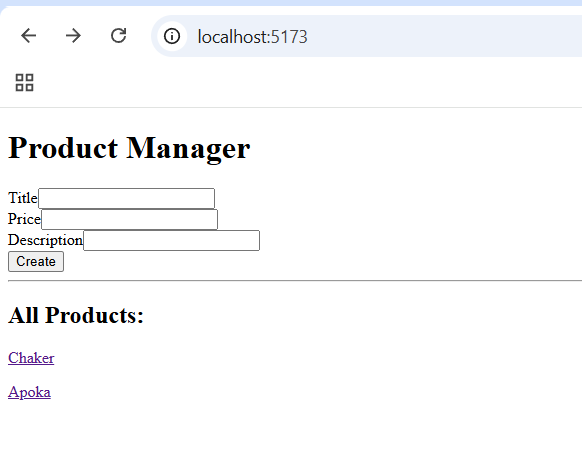

# Product Manager

A full stack MERN application for creating and viewing products. Built as the Product Manager (Part II) assignment for the Axsos Academy MERN Stack course.

Users can add a product with a title, price, and description, see all products in a list, and click any product to view its details on its own page.

## Features

- **Create a product** — a form with title, price, and description fields
- **View all products** — every product is listed as a clickable link
- **View one product** — each product has its own detail page at `/products/:id`
- **Instant updates** — a new product appears in the list right away, without reloading the page
- **Form validation** — the database rejects empty fields, prices below zero, and titles or descriptions shorter than 3 characters
- **Timestamps** — every product is saved with `createdAt` and `updatedAt`

## Technologies Used

**Frontend**

- React 19
- React Router DOM 7
- Axios
- Vite

**Backend**

- Node.js
- Express 5
- Mongoose
- MongoDB Atlas

**Other**

- dotenv — for environment variables
- cors — to connect the client and server
- nodemon — to restart the server automatically

## Screenshots

### Product Manager form and product list



### Product detail page


## Project Structure

```
product-manager/
├── client/
│   └── src/
│       ├── pages/
│       │   ├── ProductForm.jsx
│       │   ├── ProductList.jsx
│       │   └── ProductDetail.jsx
│       ├── App.jsx
│       └── main.jsx
└── server/
    ├── config/
    │   └── mongoose.config.js
    ├── controllers/
    │   └── product.controller.js
    ├── models/
    │   └── product.model.js
    ├── routes/
    │   └── product.routes.js
    └── server.js
```

## API Routes

| Method | Route                | Description             |
| ------ | -------------------- | ----------------------- |
| POST   | `/api/products`      | Create a new product    |
| GET    | `/api/products`      | Get all products        |
| GET    | `/api/products/:id`  | Get one product by id   |

## How to Run

You need Node.js installed and a MongoDB Atlas account.

### 1. Clone the repository

```bash
git clone https://github.com/YOUR_USERNAME/product-manager.git
cd product-manager
```

### 2. Set up the server

```bash
cd server
npm install
```

Create a `.env` file inside the `server` folder:

```
PORT=8000
MONGO_URI=your_mongodb_connection_string
```

Then start the server:

```bash
npm start
```

The server runs on `http://localhost:8000`.

### 3. Set up the client

Open a second terminal and leave the server running.

```bash
cd client
npm install
npm run dev
```

The client runs on `http://localhost:5173`. Open that address in your browser.

## Author

Chaker — Axsos Academy MERN Stack course
