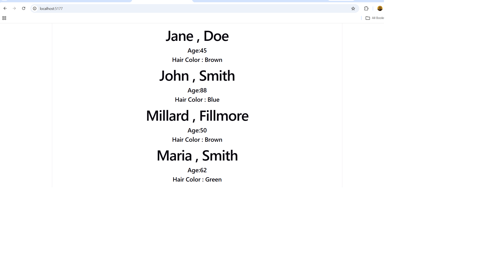

# Prop It Up

A small React project that demonstrates how to build a reusable component and pass data into it using **props**. A single `PersonCard` component is rendered four times, each time displaying a different person's information.

This is an assignment from the **Components** module of the MERN Stack course at Axsos Academy.

## Features

- A reusable `PersonCard` component that displays a single person's details
- Four props passed into each card: `firstName`, `lastName`, `age`, and `hairColor`
- The same component reused four times with different values — no forms or user input required
- Clean, self-contained presentational component driven entirely by props

## Technologies Used

- **React** — component-based UI library
- **JavaScript (ES6)** — arrow functions, destructuring, modules
- **JSX** — markup syntax used inside React components

## Getting Started

### Prerequisites

Make sure you have [Node.js](https://nodejs.org/) installed (which includes npm).

### Installation & Running

1. Clone the repository:
   ```bash
   git clone https://github.com/your-username/prop-it-up.git
   ```

2. Move into the project folder:
   ```bash
   cd prop-it-up
   ```

3. Install the dependencies:
   ```bash
   npm install
   ```

4. Start the development server:
   ```bash
   npm start
   ```

5. Open your browser and go to:
   ```
   http://localhost:3000
   ```

## Project Structure

```
prop-it-up/
├── src/
│   ├── App.jsx          # Renders four PersonCard components
│   └── PersonCard.jsx   # Reusable component that displays one person
└── README.md
```

## Screenshots




## How It Works

The `PersonCard` component receives its data through props and displays it. Because it does not hold any of its own data, it can be reused as many times as needed. In `App.jsx`, the component is called four times, and each call passes different attribute values — that is what produces four unique cards on screen.

## Author

Chaker Ibrahim— [GitHub](https://github.com/ChakerIbrahim)
