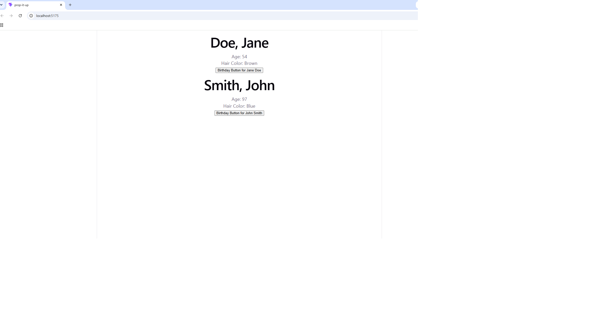

# Putting it Together

A React app that displays person cards built from **props**, where each card holds its own **state** for the person's age. Clicking a card's birthday button increases that person's age by one — and only that person's.

Built as part of the **MERN Stack** course at [Axsos Academy](https://learn.axsos.academy/) — *Components* module.

---

## Screenshots


### After clicking Jane's birthday button


---

## Features

- A reusable **PersonCard** component rendered twice with different data
- Data passed down from the parent through **props** (first name, last name, age, hair color)
- The age is stored in **state** with the `useState` hook, so it can change
- A **birthday button** on each card that increments that person's age by one
- Each card keeps its **own independent state** — clicking one button does not affect the other card

---

## Technologies Used

| Technology | Purpose |
|---|---|
| **React** | Building reusable components |
| **Props** | Passing data from parent to child |
| **useState Hook** | Storing and updating the age |
| **Vite** | Development server and build tool |
| **JavaScript (ES6+)** | Arrow functions and destructuring |

---

## Project Structure

```
putting-it-together/
├── src/
│   ├── components/
│   │   └── PersonCard.jsx    # The card: props in, age state, birthday button
│   ├── App.jsx               # Renders two PersonCard components
│   └── main.jsx              # React entry point
├── index.html
├── package.json
└── README.md
```

---

## How to Run the Project

### Prerequisites

- [Node.js](https://nodejs.org/) (v18 or higher)
- npm (comes with Node.js)

### Steps

1. **Clone the repository**

   ```bash
   git clone https://github.com/YOUR-USERNAME/YOUR-REPO.git
   ```

2. **Navigate into the project folder**

   ```bash
   cd putting-it-together
   ```

3. **Install the dependencies**

   ```bash
   npm install
   ```

4. **Start the development server**

   ```bash
   npm run dev
   ```

5. **Open the app in your browser**

   ```
   http://localhost:5173
   ```

---

## How It Works

`App.jsx` sends data down to each card as props:

```jsx
<PersonCard firstName="Jane" lastName="Doe" age={45} hairColor="Black" />
```

`PersonCard` receives that data and uses the incoming age as the **starting value** for its state:

```jsx
const [personAge, setPersonAge] = useState(age);
```

This is the key idea of the assignment. **Props are read-only** — a child component cannot change the values its parent sent. So the age gets copied into state, which *is* allowed to change:

```jsx
const handleBirthday = () => {
    setPersonAge(personAge + 1);
};
```

Calling `setPersonAge` tells React the value changed, which triggers a re-render and shows the new age on screen.

| Value | Comes from | Can it change? |
|---|---|---|
| First / Last Name | props | No |
| Hair Color | props | No |
| Age | state | Yes, via the button |

---

## What I Learned

- The difference between **props** (passed in, read-only) and **state** (owned by the component, changeable)
- How to use a prop as the **initial value** of a state variable
- That each instance of a component gets its **own separate state**, even when they come from the same file
- Why `onClick={handleBirthday}` has **no parentheses** — passing the function itself instead of calling it immediately
- That `setState` is **asynchronous**: logging the age right after updating it still prints the old value, because the new one is not available until the next render

---

## Author

**Chaker** — MERN Stack student at Axsos Academy
