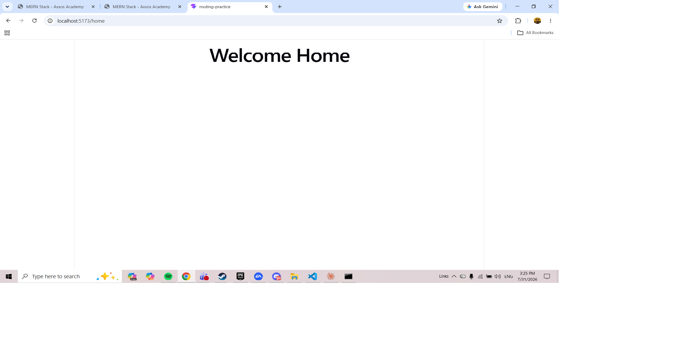
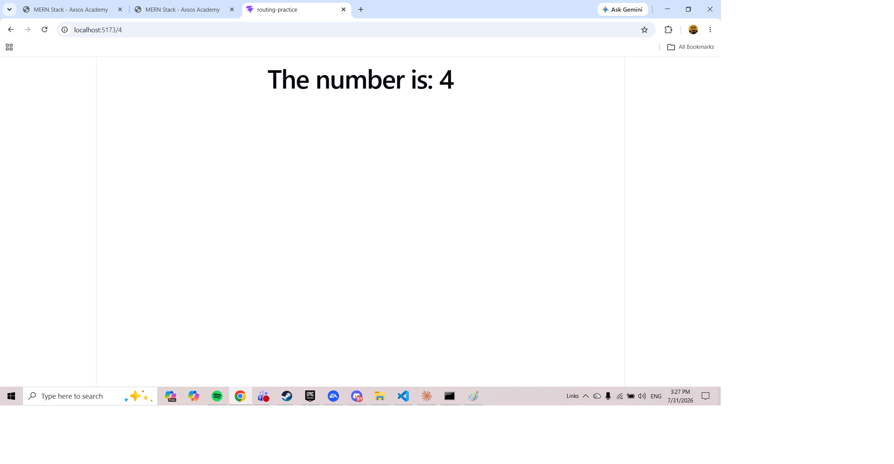
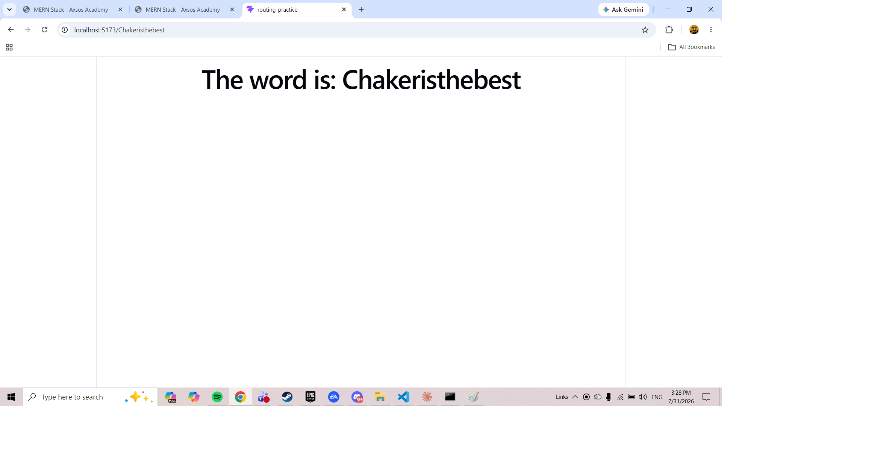
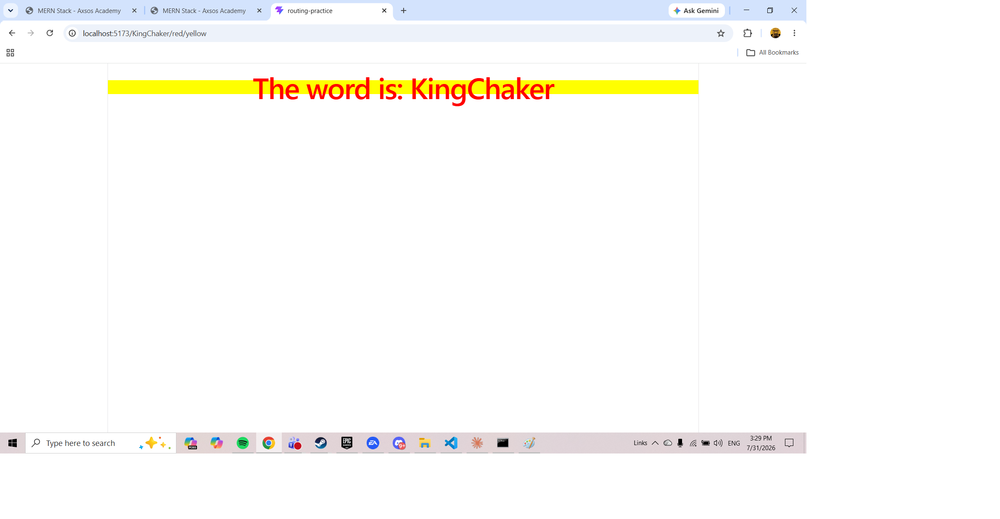

# Routing Practice

A small React application that demonstrates client-side routing with React Router. The page content changes based on the URL — including dynamic text and dynamic styling pulled directly from the URL itself.

Built as an assignment for the Axsos Academy MERN Stack course.

---

## Features

- **Home page** — a static welcome message at `/home`.
- **Number route** — `/4` displays "The number is: 4". Works with any number.
- **Word route** — `/hello` displays "The word is: hello". Works with any word.
- **Smart detection** — the number and word routes share one component. It uses `isNaN()` to decide which message to show, so no extra route is needed.
- **Styled word route** — `/hello/blue/red` displays the word with `blue` text on a `red` background. Any valid CSS color combination works.

---

## Technologies Used

| Tool | Purpose |
|---|---|
| React 18 | UI library |
| React Router DOM v6 | Client-side routing |
| Vite | Dev server and build tool |
| JavaScript (ES6+) | Language |

---

## Getting Started

### Prerequisites

- Node.js (v18 or newer)
- npm

### Installation

Clone the repository:

```bash
git clone https://github.com/your-username/routing-practice.git
cd routing-practice
```

Install dependencies:

```bash
npm install
```

Start the development server:

```bash
npm run dev
```

The app will be running at **http://localhost:5173**.

### Try These URLs

| URL | Result |
|---|---|
| `/home` | Welcome |
| `/4` | The number is: 4 |
| `/hello` | The word is: hello |
| `/hello/blue/red` | "hello" in blue text on a red background |

---

## Screenshots

### Home Page



### Number Route



### Word Route



### Styled Word Route



---

## Project Structure

```
routing-practice/
├── src/
│   ├── components/
│   │   ├── Home.jsx          # Static welcome page
│   │   ├── Display.jsx       # Handles both number and word routes
│   │   └── StyledWord.jsx    # Word with dynamic colors from the URL
│   ├── App.jsx               # Route definitions
│   ├── main.jsx              # Entry point, wraps app in BrowserRouter
│   └── index.css             # Global styles
├── screenshots/              # Images used in this README
├── index.html
├── package.json
└── vite.config.js
```

---

## How It Works

React Router matches the current URL against the patterns in `App.jsx`. Segments written as `:name` are **URL parameters** — placeholders that match any text and pass it to the component.

```jsx
<Route path="/:word/:color/:bgColor" element={<StyledWord />} />
```

Inside the component, `useParams()` reads those values:

```jsx
const { word, color, bgColor } = useParams();
```

Because URL parameters are always strings, the `/:value` route converts the text with `+value` and checks the result with `isNaN()` to tell numbers and words apart.

---

## Author

Built by **[Chaker Ibrahim]** — Axsos Academy MERN Stack, 2026.
