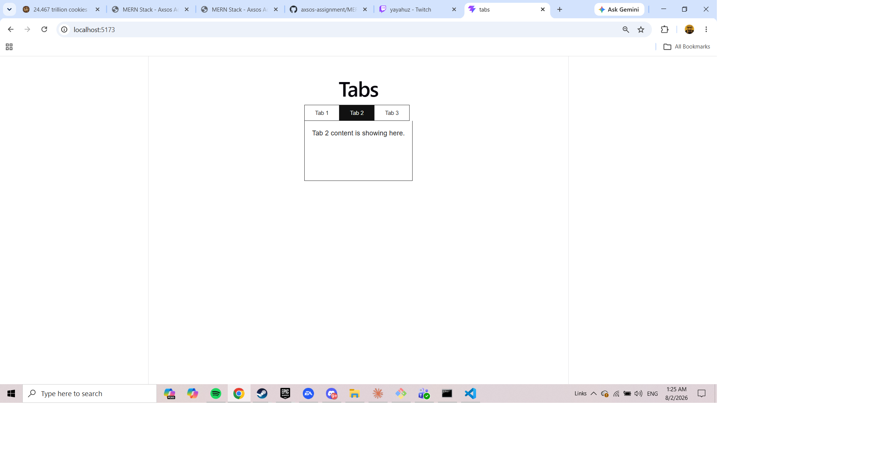
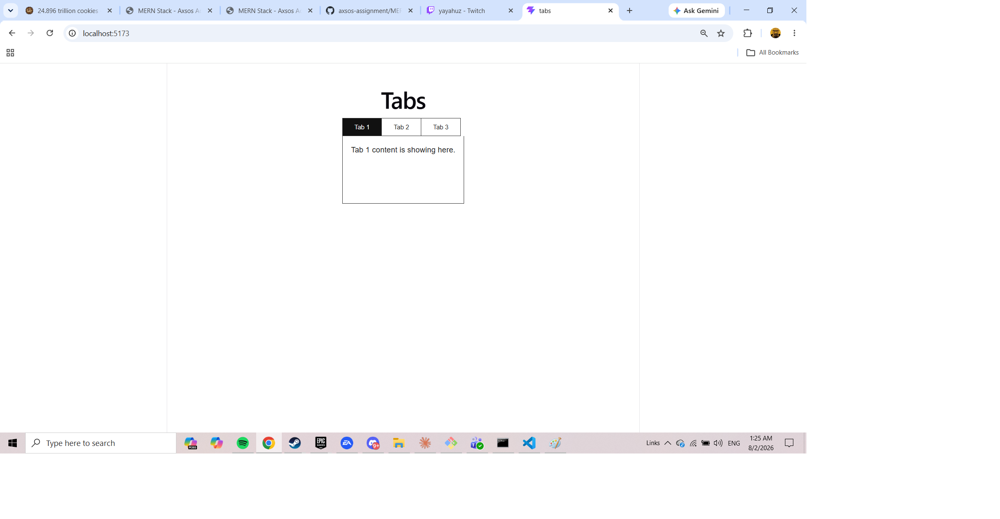
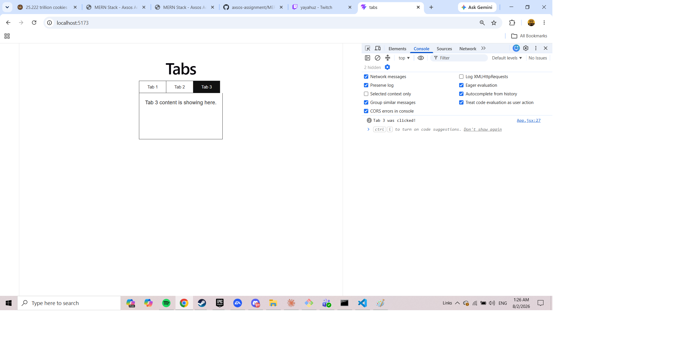

# Tabs

A reusable React tabs component. Hand it an array of tabs and it builds the headers, tracks which one is open, and swaps the content underneath — with a fade between panels.

Built for the Axsos Academy MERN Stack course (Lifting State → Tabs).



---

## Features

- **Works with any number of tabs** — the component reads the array it's given, so three tabs or seven both work with no code changes
- **Click a header to switch** the content below it
- **The open tab is highlighted** so it's always clear where you are
- **Optional per-tab callbacks** — any tab can carry a function that runs when its header is clicked
- **Animated switching** — headers ease between colours and the content panel fades in
- **Keyboard accessible** — headers are real buttons, so Tab and Enter work, and reduced-motion settings are respected





---

## Technologies Used

- **React 18** — functional components and JSX
- **useState hook** — tracks which tab is open
- **Vite** — build tool and development server
- **CSS** — flexbox for the header row, transitions and keyframes for the switching animation

---

## How to Run

You'll need [Node.js](https://nodejs.org) installed.

**1. Clone the repository**

```bash
git clone https://github.com/your-username/tabs.git
cd tabs
```

**2. Install the dependencies**

```bash
npm install
```

**3. Start the development server**

```bash
npm run dev
```

**4. Open the app**

Vite will print a local link in the terminal, usually `http://localhost:5173`. Ctrl/Cmd + click it, or paste it into your browser.

To stop the server, press `Ctrl + C` in the terminal.

---

## Project Structure

```
tabs/
├── src/
│   ├── components/
│   │   └── Tabs.jsx     the reusable component
│   ├── App.jsx          holds the tab data
│   ├── App.css          styles and animations
│   └── main.jsx         renders App into index.html
├── index.html
└── package.json
```

---

## How to Use the Component

Pass an array of objects. Each needs a `label` and `content`, and can optionally carry a `callback`:

```jsx
const tabData = [
    { label: "Tab 1", content: "Tab 1 content is showing here." },
    { label: "Tab 2", content: "Tab 2 content is showing here." },
    {
        label: "Tab 3",
        content: "Tab 3 content is showing here.",
        callback: () => console.log("Tab 3 was clicked!")
    }
];

<Tabs tabs={ tabData } />
```

---

## How It Works

One number runs the whole component — the position of the open tab:

```jsx
const [activeIndex, setActiveIndex] = useState(0);
```

`map` builds a header per tab. Each header's click handler is wrapped in an arrow function so it can send the tab and its index along with the event — without that, the handler couldn't tell which header was pressed:

```jsx
{ props.tabs.map( (tab, i) =>
    <button
        key={ i }
        className={ i === activeIndex ? "tab-header active" : "tab-header" }
        onClick={ (e) => handleTabClick(e, tab, i) }
    >
        { tab.label }
    </button>
) }
```

The handler stores the new index and fires the tab's callback if it has one:

```jsx
const handleTabClick = (e, tab, i) => {
    setActiveIndex(i);

    if (tab.callback) {
        tab.callback();
    }
};
```

The content panel then reads straight from the array. Giving it `key={ activeIndex }` makes React mount a fresh element on every switch, which is what restarts the fade-in animation:

```jsx
<div className="tab-content" key={ activeIndex }>
    { props.tabs[ activeIndex ].content }
</div>
```