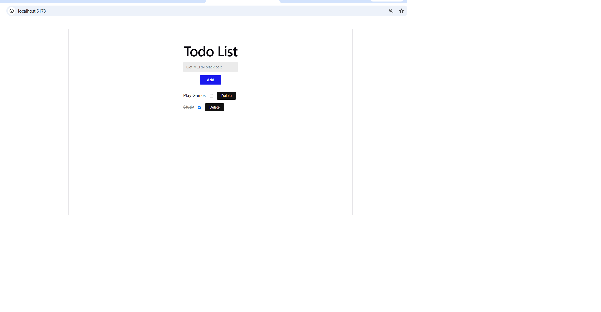
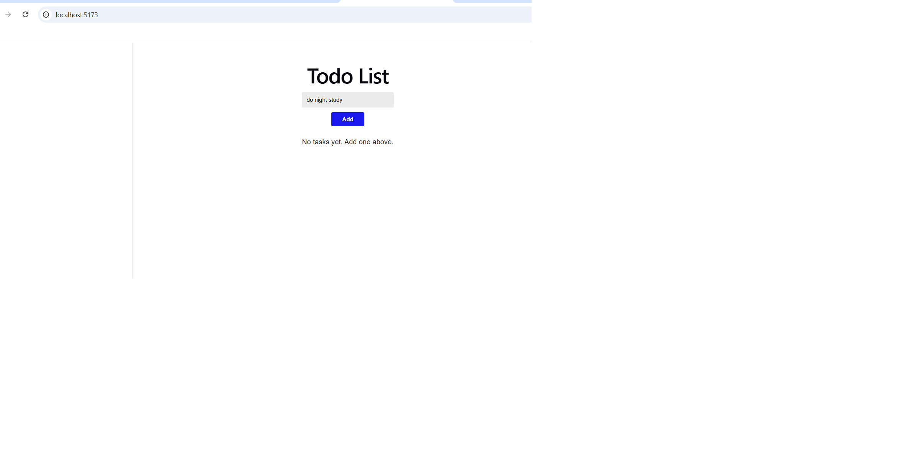
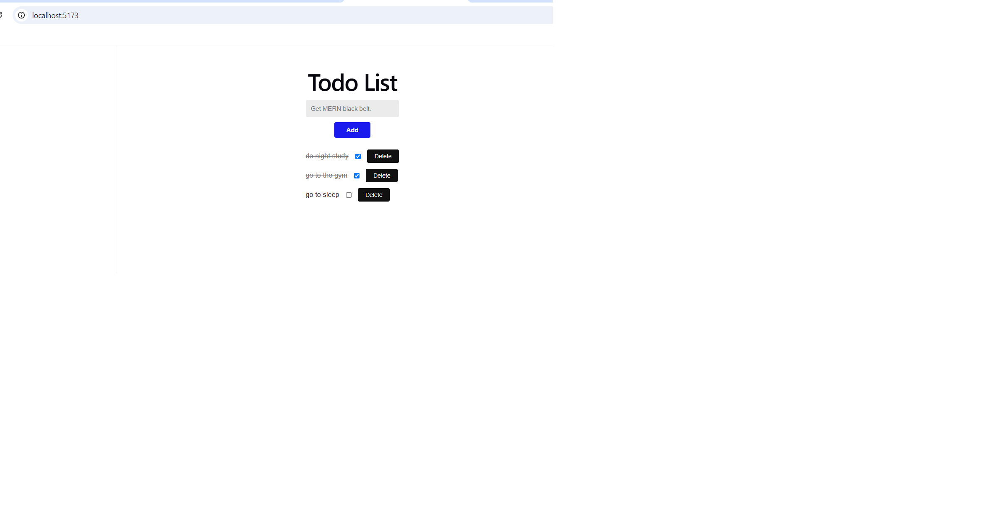

# Todo List

Add tasks, tick them off, delete the ones you're done with. Completed tasks get crossed out so finished work stays visible without cluttering the list.

Built for the Axsos Academy MERN Stack course (Lifting State → Todo List).



---

## Features

- **Add tasks** — type a description and hit Add
- **Tick tasks off** — the checkbox next to each task marks it complete
- **Completed tasks are crossed out** and greyed, so they're clearly distinguished
- **Delete tasks** — remove anything you no longer need
- **Input clears after adding**, ready for the next task
- **Empty tasks are rejected** with a message instead of a blank row
- **Helpful empty state** before the first task is added





---

## Technologies Used

- **React 18** — functional components and JSX
- **useState hook** — holds the task list and the form's input
- **Vite** — build tool and development server
- **CSS** — flexbox for the task rows, a class toggle for the strikethrough

---

## How to Run

You'll need [Node.js](https://nodejs.org) installed.

**1. Clone the repository**

```bash
git clone https://github.com/your-username/todo-list.git
cd todo-list
```

**2. Install the dependencies**

```bash
npm install
```

**3. Start the development server**

```bash
npm run dev
```

**4. Open the app**

Vite will print a local link in the terminal, usually `http://localhost:5173`. Ctrl/Cmd + click it, or paste it into your browser.

To stop the server, press `Ctrl + C` in the terminal.

---

## Project Structure

```
todo-list/
├── src/
│   ├── components/
│   │   ├── TodoForm.jsx      the input for adding tasks
│   │   └── TodoDisplay.jsx   renders every task row
│   ├── App.jsx               holds the task list
│   ├── App.css               styles
│   └── main.jsx              renders App into index.html
├── index.html
└── package.json
```

---

## How It Works

The form and the list are siblings, so they can't pass data to each other directly — props only flow downward. The tasks therefore live in **App**, their shared parent, which also owns every function that changes them:

```jsx
const [tasks, setTasks] = useState([]);

<TodoForm onNewTask={ addTask } />
<TodoDisplay tasks={ tasks } onDelete={ deleteTask } onToggle={ toggleTask } />
```

Each of the three operations builds new data rather than editing what's already there.

**Adding** spreads the existing tasks into a new array:

```jsx
setTasks([ ...tasks, { text: taskText, complete: false } ]);
```

**Deleting** filters out the task at the clicked position:

```jsx
setTasks( tasks.filter( (task, i) => i !== indexToDelete ) );
```

**Toggling** maps over the list, replacing only the task that changed with a copy of itself:

```jsx
setTasks(
    tasks.map( (task, i) => {
        if (i === indexToToggle) {
            return { ...task, complete: !task.complete };
        } else {
            return task;
        }
    })
);
```

That last one is why neither the array nor any task object is ever mutated: `map` produces a new array, and the spread produces a new object for the single task being flipped.

The display then renders each task, with a ternary adding the strikethrough class to anything complete:

```jsx
<span className={ task.complete ? "task-text done" : "task-text" }>
    { task.text }
</span>

<input
    type="checkbox"
    checked={ task.complete }
    onChange={ (e) => props.onToggle(i) }
/>
```

Checkboxes bind to `checked` rather than `value`, since they hold a boolean instead of text. Wrapping the handler in an arrow function is what lets each row send its own index back up to App.