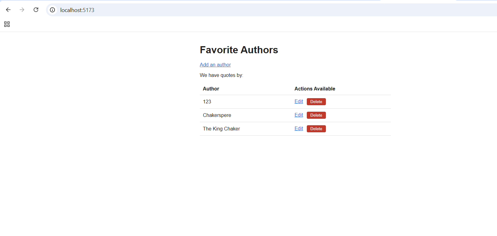
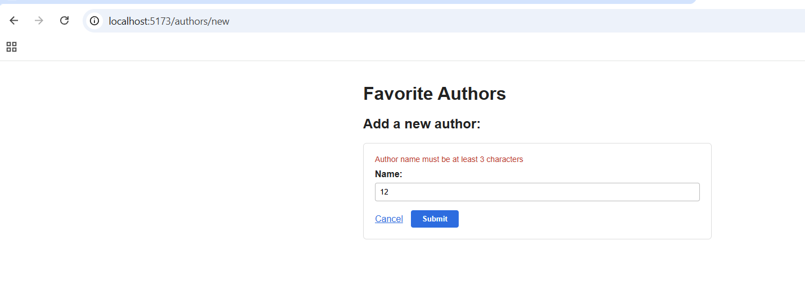
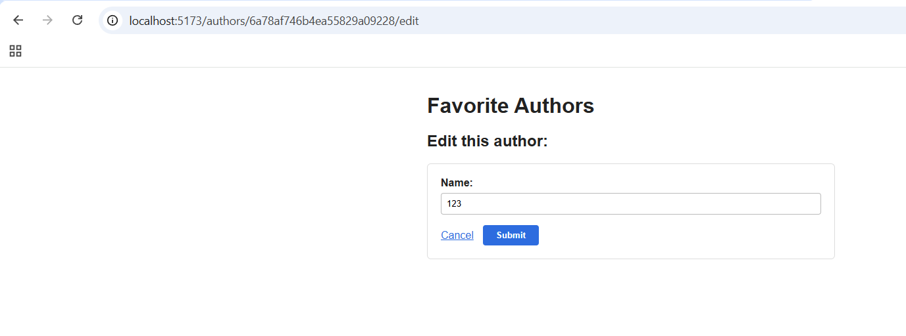

# Authors

A full stack MERN app for keeping a list of your favourite authors. Add them, edit them, delete them — with validation handled on the server so bad data never reaches the database.

Built for the Axsos Academy MERN Stack course (Advance MERN → Authors).



---

## Features

- **List every author**, sorted alphabetically
- **Add an author** on its own page, redirecting back to the list on success
- **Edit an author** with the form pre-filled with their current name
- **Delete an author** — the row disappears immediately, no page refresh
- **Backend validation** — names must be at least 3 characters, enforced on create *and* edit
- **Error messages** from the server displayed above the form
- **Friendly 404** — visiting an edit page for an author that doesn't exist offers a link to add them instead





---

## Technologies Used

- **MongoDB** — stores the authors, hosted on Atlas
- **Express** — the API server
- **React 18** — the client, with React Router for navigation
- **Node.js** — runs the server
- **Mongoose** — schema, validation, and database queries
- **Axios** — carries requests between the client and the API
- **Vite** — build tool and development server for the client

---

## How to Run

You'll need [Node.js](https://nodejs.org) installed and a free [MongoDB Atlas](https://www.mongodb.com/cloud/atlas/register) account.

**1. Clone the repository**

```bash
git clone https://github.com/your-username/authors.git
cd authors
```

**2. Set up the server**

```bash
cd server
npm install
```

Create a `.env` file inside the `server` folder:

```
PORT=8000
DB=authors_db
ATLAS_USERNAME=your_atlas_username
ATLAS_PASSWORD=your_atlas_password
```

Then start it:

```bash
nodemon server.js
```

You should see "Established a connection to the database" and "Listening on port: 8000".

**3. Set up the client**

In a second terminal:

```bash
cd client
npm install
npm run dev
```

**4. Open the app**

Vite will print a local link, usually `http://localhost:5173`. Ctrl/Cmd + click it, or paste it into your browser.

Both terminals need to stay running. Press `Ctrl + C` in either to stop it.

---

## Project Structure

```
authors/
├── server/
│   ├── config/
│   │   └── mongoose.config.js    connects to Atlas
│   ├── controllers/
│   │   └── author.controller.js  all the CRUD logic
│   ├── models/
│   │   └── author.model.js       the schema and validation
│   ├── routes/
│   │   └── author.routes.js      maps URLs to controller methods
│   ├── .env                      secrets, not committed
│   ├── .gitignore
│   └── server.js
└── client/
    ├── src/
    │   ├── components/
    │   │   ├── AuthorForm.jsx    one form, used by add and edit
    │   │   └── AuthorList.jsx    renders the table of authors
    │   ├── views/
    │   │   ├── Main.jsx          the list page
    │   │   ├── New.jsx           the add page
    │   │   └── Update.jsx        the edit page
    │   ├── App.jsx               the routes
    │   ├── App.css
    │   └── main.jsx              wraps the app in BrowserRouter
    └── index.html
```

---

## API Routes

| Method | Route | What it does |
|---|---|---|
| GET | `/api/authors` | every author |
| GET | `/api/authors/:id` | one author |
| POST | `/api/authors` | create an author |
| PATCH | `/api/authors/:id` | update an author |
| DELETE | `/api/authors/:id` | delete an author |

---

## How It Works

The validation lives in the Mongoose schema, so the rule is written once and applies everywhere:

```js
const AuthorSchema = new mongoose.Schema({
    name: {
        type: String,
        required: [true, "Author name is required"],
        minlength: [3, "Author name must be at least 3 characters"]
    }
}, { timestamps: true });
```

When a save fails, the controller responds with a 400 status. That's what makes Axios treat it as an error and run `.catch` on the client:

```js
.catch(err => res.status(400).json(err));
```

The update route passes `runValidators: true`, because Mongoose skips validation on updates by default — without it, an edit could sneak a one-letter name past the same rule that blocks it on create:

```js
Author.findOneAndUpdate(
    { _id: req.params.id },
    req.body,
    { new: true, runValidators: true }
)
```

On the client, one `AuthorForm` component serves both the add and edit pages. The difference is a function passed down as a prop — the parent decides whether submitting means POST or PATCH:

```jsx
<AuthorForm
    initialName=""
    onSubmitProp={ createAuthor }
    errors={ errors }
/>
```

Mongoose returns errors as an object keyed by field name, so the client loops over the keys to pull out the readable messages:

```jsx
const errorResponse = err.response.data.errors;
const errorArr = [];
for (const key of Object.keys(errorResponse)) {
    errorArr.push(errorResponse[key].message);
}
setErrors(errorArr);
```

Deleting removes the author from state with `filter`, which returns a new array rather than editing the existing one — so React sees a change and re-renders without a refresh:

```jsx
const removeFromDom = (authorId) => {
    setAuthors( authors.filter( author => author._id !== authorId ) );
};
```
