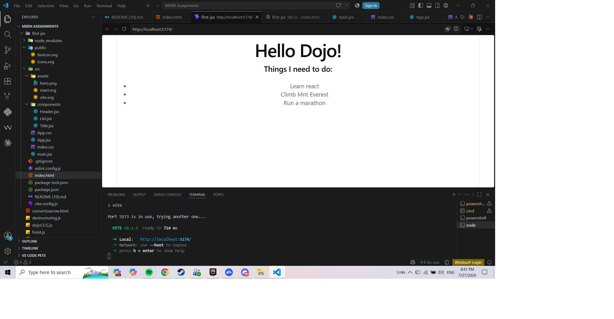

# Hello Dojo — First JSX

A small React project built with Vite for the "First JSX" assignment. It renders a
"Hello Dojo!" heading and a simple to-do list using reusable JSX components.

## Features

- Displays a **"Hello Dojo!"** heading.
- Displays a **"Things I need to do:"** subheading.
- Renders a **to-do list** from an array of items.
- Built from small, reusable components (`Header`, `Title`, `List`) that receive
  their content through props.

## Technologies Used

- **React** – UI library for building the components.
- **Vite** – build tool and development server.
- **JavaScript (JSX)** – markup written directly inside the components.
- **HTML / CSS** – base page and styling.

## Screenshot




## How to Run the Project

1. Clone the repository:
   ```bash
   git clone <your-repo-url>
   ```
2. Move into the project folder:
   ```bash
   cd <project-folder>
   ```
3. Install the dependencies:
   ```bash
   npm install
   ```
4. Start the development server:
   ```bash
   npm run dev
   ```
5. Open the local URL shown in the terminal (usually http://localhost:5173) in your browser.

## Project Structure

```
src/
├── assets/            # images (react.svg, vite.svg, hero.png)
├── components/
│   ├── Header.jsx     # renders the main "Hello Dojo!" heading
│   ├── Title.jsx      # renders the "Things I need to do:" subheading
│   └── List.jsx       # renders the to-do list from an array
├── App.jsx            # puts all the components together
├── main.jsx           # entry point that mounts App to the page
├── App.css            # component styles
└── index.css          # global styles
```
