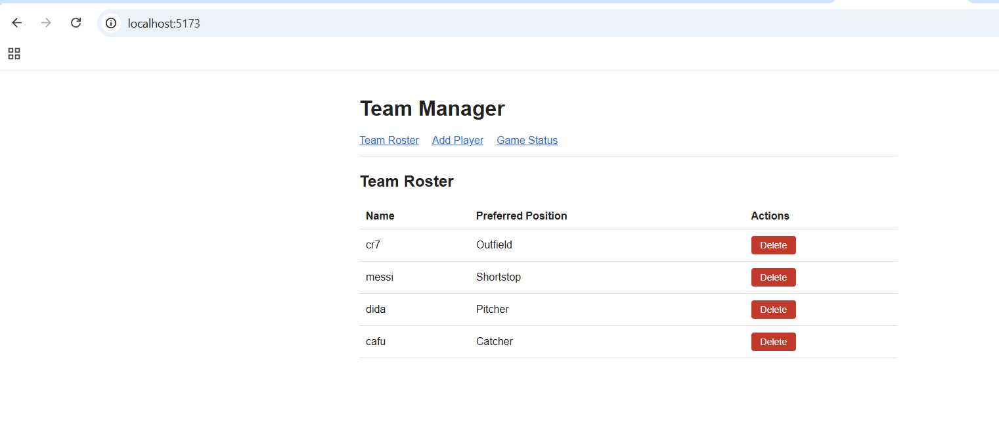
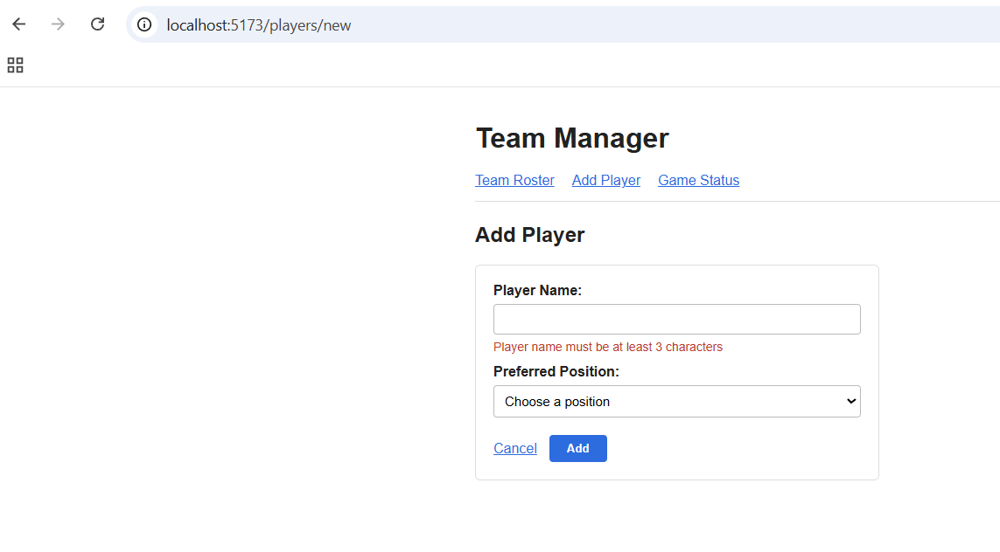
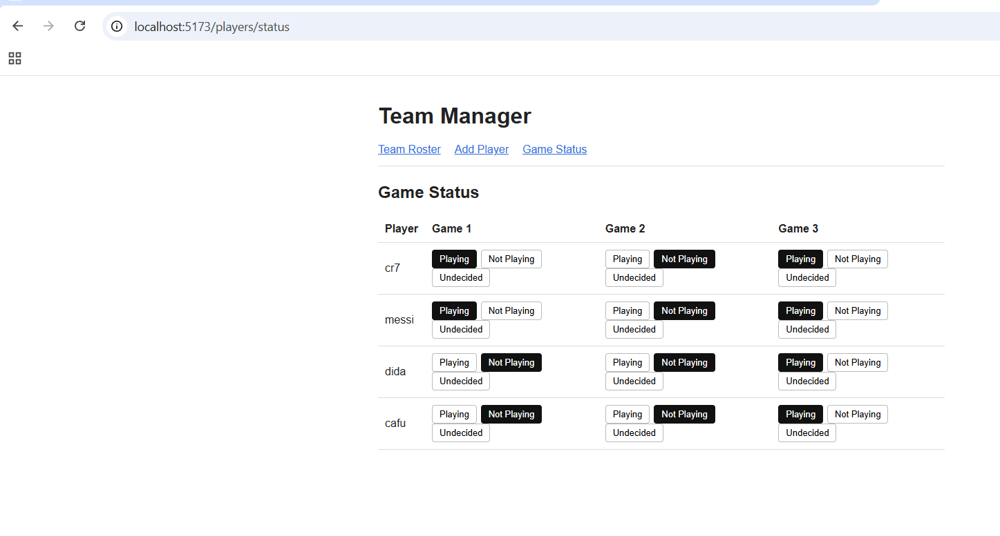
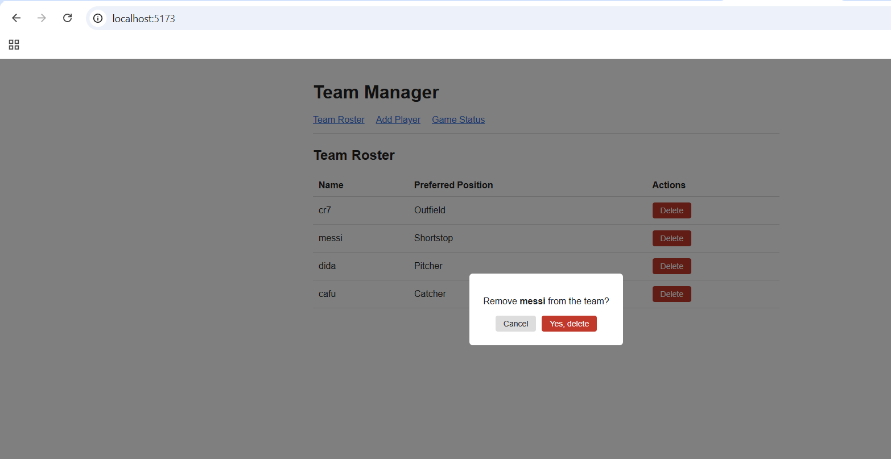

# Team Manager

A full stack MERN app for managing a team roster and tracking who's available for a three-game series. Add players, remove them, and set each one's status per game.

Built for the Axsos Academy MERN Stack course (Advance MERN → Team Manager).



---

## Features

- **List every player** with their name and preferred position
- **Add a player** on its own page, redirecting back to the list on success
- **Delete a player** — the row disappears immediately, no page refresh
- **Confirmation popup** before a delete goes through, so nobody is removed by accident
- **Player status page** — set each player to Playing, Not Playing, or Undecided for all three games
- **Backend validation** — names must be at least 3 characters and a position is required, enforced by the database schema
- **Frontend validation** — the same rules checked as you type, so mistakes are caught before a request is even sent







---

## Technologies Used

- **MongoDB** — stores the players, hosted on Atlas
- **Express** — the API server
- **React 18** — the client, with React Router for navigation
- **Node.js** — runs the server
- **Mongoose** — schema, validation, and database queries
- **Axios** — carries requests between the client and the API
- **Vite** — build tool and development server for the client

---

## How to Run

You'll need [Node.js](https://nodejs.org) installed and a free [MongoDB Atlas](https://www.mongodb.com/cloud/atlas/register) account.

**1. Clone the repository**

```bash
git clone https://github.com/your-username/team-manager.git
cd team-manager
```

**2. Set up the server**

```bash
cd server
npm install
```

Create a `.env` file inside the `server` folder:

```
PORT=8000
MONGO_URI=your_atlas_connection_string_here
```

Then start it:

```bash
nodemon server.js
```

You should see "Server running on port 8000" and "connected to db".

**3. Set up the client**

In a second terminal:

```bash
cd client
npm install
npm run dev
```

**4. Open the app**

Vite will print a local link, usually `http://localhost:5173`. Ctrl/Cmd + click it, or paste it into your browser.

Both terminals need to stay running. Press `Ctrl + C` in either to stop it.

---

## Project Structure

```
team-manager/
├── server/
│   ├── config/
│   │   └── mongoose.config.js    connects to Atlas
│   ├── controllers/
│   │   └── player.controller.js  all the CRUD logic
│   ├── models/
│   │   └── player.model.js       the schema and validation
│   ├── routes/
│   │   └── player.routes.js      maps URLs to controller methods
│   ├── .env                      secrets, not committed
│   ├── .gitignore
│   └── server.js
└── client/
    ├── src/
    │   ├── components/
    │   │   ├── PlayerForm.jsx    the add form, with live validation
    │   │   ├── PlayerList.jsx    the roster table
    │   │   └── DeleteButton.jsx  the button and its confirm popup
    │   ├── views/
    │   │   ├── Main.jsx          the roster page
    │   │   ├── New.jsx           the add page
    │   │   └── Status.jsx        the three-game status page
    │   ├── App.jsx               the routes
    │   ├── App.css
    │   └── main.jsx              wraps the app in BrowserRouter
    └── index.html
```

---

## API Routes

| Method | Route | What it does |
|---|---|---|
| GET | `/api/players` | every player |
| GET | `/api/players/:id` | one player |
| POST | `/api/players` | create a player |
| PATCH | `/api/players/:id` | update a player |
| DELETE | `/api/players/:id` | delete a player |

The status page uses the same PATCH route as any other edit — a status change is just an update to one field.

---

## How It Works

The validation lives in the Mongoose schema, so the rules are written once and apply to every route that saves:

```js
const PlayerSchema = new mongoose.Schema({
    name: {
        type: String,
        required: [true, "Player name is required"],
        minlength: [3, "Player name must be at least 3 characters"]
    },
    preferredPosition: {
        type: String,
        required: [true, "Preferred position is required"]
    },
    game1: { type: String, default: "Undecided" },
    game2: { type: String, default: "Undecided" },
    game3: { type: String, default: "Undecided" }
}, { timestamps: true });
```

When a save fails, the controller responds with a 400 status. That's what makes Axios treat it as an error and run `.catch` on the client:

```js
.catch(err => res.status(400).json(err));
```

The three games are stored as three plain fields with a default, so a new player is Undecided everywhere without the form asking about it.

On the status page, each cell maps over the three possible statuses to build its buttons, and a ternary highlights whichever one is currently set:

```jsx
{ statuses.map( (status, i) =>
    <button
        key={ i }
        className={ player[game] === status ? "status-btn active" : "status-btn" }
        onClick={ (e) => changeStatus(player._id, game, status) }
    >
        { status }
    </button>
) }
```

Changing a status sends a PATCH with a single field, then updates state locally so the table redraws without refetching:

```jsx
axios.patch(`http://localhost:8000/api/players/${playerId}`, { [game]: newStatus })
```

Deleting removes the player from state with `filter`, which returns a new array rather than editing the existing one — so React sees a change and re-renders without a refresh:

```jsx
const removeFromDom = (playerId) => {
    setPlayers( players.filter( player => player._id !== playerId ) );
};
```

The confirmation popup is its own component holding a single boolean. Clicking Delete flips it to `true`, which renders the dialog; the real request only fires once the user confirms.
